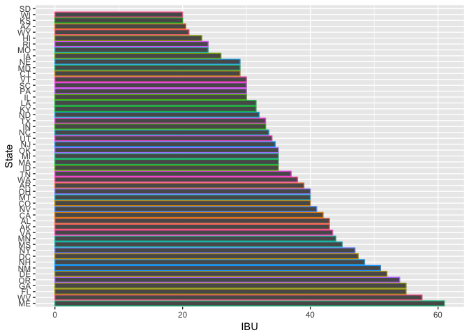
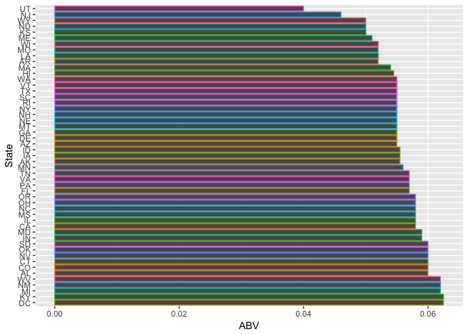
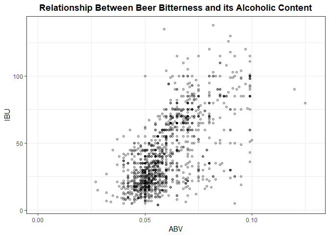

#Introduction

The purpose of this study is to help "Brewing Bros" assess the market size and competition, to help them decide where the next "Brewing Bros" brewery should be built and what type of beer it should brew. The data used in this study was derived from "The National Beer and Wine Association" and includes 2410 US craft beers from 558 US breweries. (see Codebook for specific details)

#Tidy Data Process
Data for this project came from two different sources, a dataset containing beers and information about them, such as the brewery they came from, their name, and their alcohol content (Beers.csv) and a dataset of breweries, with information including where they are located (Breweries.csv).  Both data sets had extensive errors and duplications that were correct or eliminated prior to beginning the research.

The dataset was parsed for duplicate beers and breweries, which were deleted, and misspellings cities were corrected and any information that needed to be merged, was then merged. 

#####Beers File

```r
#Tidying of Beers:
#read in Beers data set with correct character formatting.
Beers <- read.csv("Beers.csv", header=TRUE, fileEncoding = 'UTF-8', stringsAsFactors = F)
```


```r
#Remove duplicate beers if ALL columns but the Beer ID are the same. 
UniqueBeers <- Beers[!duplicated(Beers[c(1,3,4,5,6,7)]),]
```


```r
#Group beers by Brewery and Size
if(FALSE){
  byBrewery <- split(UniqueBeers, list(UniqueBeers$Ounces, UniqueBeers$Brewery_id))

# Match First 3 Chars
for(i in 1:length(byBrewery)){
    uniTempVec <- unique(byBrewery[[i]]$Name)
    tempListVec <- character()
    for(i in 1:length(uniTempVec)){
      subTobeSearched <- substr(uniTempVec[i], 1,3)
      subTobeSearched <- paste0("^",subTobeSearched)
      tempVec <- unique(grep(subTobeSearched, uniTempVec, ignore.case = T, value = T))
      if(length(tempVec) > 1){
        tempListVec <- c(tempListVec, paste(" ", tempVec, collapse = " "))
      }
    }

    unitempListVec <- unique(tempListVec)
    for(i in 1:length(unitempListVec)){
      temp2Vec <- as.vector(unlist(strsplit(trimws(unitempListVec[i], "l"), "   ")))
      if(length(temp2Vec) > 1){
        for(i in 1:length(temp2Vec)){
          cat(temp2Vec[i], file = "./First3matches.csv", append = T)
          if(i != length(temp2Vec)){
            cat(", ", file = "./First3matches.csv", append = T)
          }  
        }
        cat("\n", file = "./First3matches.csv", append = T)
      }
    }
  }

# Match Last 3 chars
  for(i in 1:length(byBrewery)){
    uniTempVec <- as.character(unique(byBrewery[[i]]$Name))
    tempListVec <- character()
    for(i in 1:length(uniTempVec)){
      subTobeSearched <- substr(uniTempVec[i], nchar(uniTempVec[i]) - 3, nchar(uniTempVec[i]))
      subTobeSearched <- paste0(subTobeSearched, "$")
      tempVec <- unique(grep(subTobeSearched, uniTempVec, ignore.case = T, value = T))
      if(length(tempVec) > 1){
        tempListVec <- c(tempListVec, paste(" ", tempVec, collapse = " "))
      }
    }

    unitempListVec <- unique(tempListVec)
    for(i in 1:length(unitempListVec)){
      temp2Vec <- as.vector(unlist(strsplit(trimws(unitempListVec[i], "l"), "   ")))
      if(length(temp2Vec) > 1){
        for(i in 1:length(temp2Vec)){
          cat(temp2Vec[i], file = "./Last3matches.csv", append = T)
          if(i != length(temp2Vec)){
            cat(", ", file = "./Last3matches.csv", append = T)
          }  
        }
        cat("\n", file = "./Last3matches.csv", append = T)
      }
    }
  }
}
```


```r
#Removed beers with identical ABU, IBU, Brewery_id, Ounces but slight differences in name
UniqueBeers <- subset(UniqueBeers, Name != "Ranger IPA (Current)")
UniqueBeers <- subset(UniqueBeers, Name != "Shift (1)")
UniqueBeers <- subset(UniqueBeers, Name != "Point Special (Current)")
UniqueBeers <- subset(UniqueBeers, Name != "Cherry Ale (1)")
UniqueBeers <- subset(UniqueBeers, Name != "Pleasure Town")
UniqueBeers <- subset(UniqueBeers, Name != "Farmer Ted's Cream Ale")
UniqueBeers <- subset(UniqueBeers, Name != "Dry Cider")
UniqueBeers <- subset(UniqueBeers, Name != "Abbey's Single (2015- )")
UniqueBeers <- subset(UniqueBeers, Name != "Triomphe")
UniqueBeers <- subset(UniqueBeers, Name != "Bender")
UniqueBeers <- subset(UniqueBeers, Name != "Hipster Ale (Westbrook Brewing)")

#rename Hipster Ale (Two Roads Brewing) to Hipster Ale; Two Roads Brewing does not brew Hipster Ale
levels(UniqueBeers$Name)[levels(UniqueBeers$Name) == "Hipster Ale (Two Roads Brewing)"] = "Hipster Ale"
```

```r
#Add code to change Brewery_ID column to match the Brews file and create CSV output of clean data.
colnames(UniqueBeers)[colnames(UniqueBeers)=="Brewery_id"] <- "Brew_ID"

#Write Clean File
write.csv(UniqueBeers, file="CleanedBeerData.csv", row.names = F)
```
#####Brewery

```r
#Tidying Breweries.csv Section. Completed by Rajat and Andy
#First inspect the State column.  We listed out the States and got the count for each.  If observation > 50, we investigated further by examining all the States with a count of 1 (DC, ND, SD, WV).  In this case, there was 51 States and confirmed the 51st was DC which is acceptable.  All abbreviations in State column is valid.
breweries <- read.csv("Breweries.csv", header = TRUE)
str(breweries)
```

```
## 'data.frame':	558 obs. of  4 variables:
##  $ Brew_ID: int  1 2 3 4 5 6 7 8 9 10 ...
##  $ Name   : Factor w/ 551 levels "10 Barrel Brewing Company",..: 355 12 266 319 201 136 227 477 59 491 ...
##  $ City   : Factor w/ 384 levels "Abingdon","Abita Springs",..: 228 200 122 299 300 62 91 48 152 136 ...
##  $ State  : Factor w/ 51 levels " AK"," AL"," AR",..: 24 18 20 5 5 41 6 23 23 23 ...
```

```r
summary(breweries)
```

```
##     Brew_ID                           Name           City    
##  Min.   :  1.0   Blackrocks Brewery     :  2   Portland: 17  
##  1st Qu.:140.2   Blue Mountain Brewery  :  2   Boulder :  9  
##  Median :279.5   Lucette Brewing Company:  2   Chicago :  9  
##  Mean   :279.5   Oskar Blues Brewery    :  2   Seattle :  9  
##  3rd Qu.:418.8   Otter Creek Brewing    :  2   Austin  :  8  
##  Max.   :558.0   Sly Fox Brewing Company:  2   Denver  :  8  
##                  (Other)                :546   (Other) :498  
##      State    
##   CO    : 47  
##   CA    : 39  
##   MI    : 32  
##   OR    : 29  
##   TX    : 28  
##   PA    : 25  
##  (Other):358
```

```r
table(breweries$State)
```

```
## 
##  AK  AL  AR  AZ  CA  CO  CT  DC  DE  FL  GA  HI  IA  ID  IL  IN  KS  KY 
##   7   3   2  11  39  47   8   1   2  15   7   4   5   5  18  22   3   4 
##  LA  MA  MD  ME  MI  MN  MO  MS  MT  NC  ND  NE  NH  NJ  NM  NV  NY  OH 
##   5  23   7   9  32  12   9   2   9  19   1   5   3   3   4   2  16  15 
##  OK  OR  PA  RI  SC  SD  TN  TX  UT  VA  VT  WA  WI  WV  WY 
##   6  29  25   5   4   1   3  28   4  16  10  23  20   1   4
```


```r
#In this section, looking to clean up the "City" column.  Still looking for a more elequent code but for now creating subsets for each letter and visually identifying misspellings, abbreviations, and/or punctuations.  Rajat to research a function that creates a subset of cities by subsetting cities with the same 3 letter string.
unique(breweries[grep("[.]", breweries$City), "City"])
```

```
## [1] St. Paul     Mt. Airy     St. John's   Mt. Pleasant
## 384 Levels: Abingdon Abita Springs Ada Afton Airway Heights ... York
```

```r
unique(breweries[grep("^[Mm].*", breweries$City), "City"])
```

```
##  [1] Minneapolis        Marquette          Martinsville      
##  [4] Michigan City      Mishawaka          Murphysboro       
##  [7] Manhattan          Mt. Airy           Madison           
## [10] Morganton          Milwaukee          Monroe            
## [13] Middleton          Middleburg Heights Memphis           
## [16] Mount Pleasant     Middlebury         Montauk           
## [19] Mill Valley        Meridian           Meadville         
## [22] Missoula           Monument           Midvale           
## [25] Mustang            Midwest City       Menominee         
## [28] Manheim            Mt. Pleasant       Miami             
## [31] Moab               Macon              Medford           
## [34] Menominie          Minnetonka         Marietta          
## [37] Mooresville        Marlborough        Myrtle Beach      
## [40] Mammoth Lakes     
## 384 Levels: Abingdon Abita Springs Ada Afton Airway Heights ... York
```

```r
unique(breweries[grep("^[Ss].*", breweries$City), "City"])
```

```
##  [1] San Diego           San Francisco       South Lyon         
##  [4] Seven Points        Stevens Point       St. Paul           
##  [7] Saint Louis         San Antonio         St Petersburg      
## [10] Sheridan            St Mary's           St Paul            
## [13] Springdale          Sisters             Salt Lake City     
## [16] Shelburne           Spring Lake         Springfield        
## [19] Seattle             Spearfish           Stillwater         
## [22] Stamford            Southampton         Santa Cruz         
## [25] Somerset Center     South Austin        Shreveport         
## [28] South Deerfield     South Burlington    St. John's         
## [31] Santee              South Bend          San Luis Obispo    
## [34] Shelbyville         Santa Fe            Sacramento         
## [37] Savannah            Slippery Rock       Stratford          
## [40] Soldotna            South San Francisco Spirit Lake        
## [43] Sheffield           Silverton           Stevensville       
## [46] Smithton           
## 384 Levels: Abingdon Abita Springs Ada Afton Airway Heights ... York
```


```r
#Data Exploration Done, Cleaning begins   
BrDF <- read.csv("Breweries.csv", header = T, stringsAsFactors = F)
# First find and substitute any abbreviations symbols as "." with full form. Ex St. would be replaced
# with Saint, Mt. would be replaced with Mount etc
grep("[[:punct:]]",BrDF$City, value = T)
```

```
## [1] "St. Paul"      "Mt. Airy"      "Wilkes-Barre"  "St Mary's"    
## [5] "St. John's"    "Fuquay-Varina" "Mt. Pleasant"  "O'Fallon"
```

```r
grep("[[:punct:][:blank:]]+",BrDF$City, value = T)
```

```
##   [1] "San Diego"           "San Francisco"       "Grand Rapids"       
##   [4] "Grand Rapids"        "Comstock Park"       "South Lyon"         
##   [7] "Grand Rapids"        "Michigan City"       "Seven Points"       
##  [10] "Kansas City"         "Stevens Point"       "San Diego"          
##  [13] "San Francisco"       "Dripping Springs"    "East Fairfield"     
##  [16] "Paso Robles"         "St. Paul"            "Saint Louis"        
##  [19] "Brooklyn Center"     "San Antonio"         "St Petersburg"      
##  [22] "Mt. Airy"            "San Francisco"       "Fort Collins"       
##  [25] "Traverse City"       "East Windsor"        "Wilkes-Barre"       
##  [28] "San Diego"           "Lone Tree"           "North Woodstock"    
##  [31] "St Mary's"           "Stevens Point"       "St Paul"            
##  [34] "Cold Spring"         "Baton Rouge"         "Salt Lake City"     
##  [37] "Fort Worth"          "Traverse City"       "West Chester"       
##  [40] "Garden City"         "White Salmon"        "New Orleans"        
##  [43] "Fort Worth"          "Oklahoma City"       "Spring Lake"        
##  [46] "Paw Paw"             "Oklahoma City"       "San Antonio"        
##  [49] "San Diego"           "Farmers Branch"      "Cherry Hill"        
##  [52] "Atlantic Highlands"  "Middleburg Heights"  "Lake Geneva"        
##  [55] "Lake Havasu City"    "Los Angeles"         "College Station"    
##  [58] "Plant City"          "Santa Cruz"          "Somerset Center"    
##  [61] "South Austin"        "Mount Pleasant"      "Bridgewater Corners"
##  [64] "South Deerfield"     "Mill Valley"         "Ridgefield Park"    
##  [67] "Port Clinton"        "San Diego"           "Idaho Springs"      
##  [70] "Salt Lake City"      "South Burlington"    "Virginia Beach"     
##  [73] "Garden City"         "San Francisco"       "Black Mountain"     
##  [76] "Saint Louis"         "Diamond Springs"     "St. John's"         
##  [79] "Boynton Beach"       "South Bend"          "Green Bay"          
##  [82] "San Luis Obispo"     "Fuquay-Varina"       "Lake Barrington"    
##  [85] "San Francisco"       "Buena Vista"         "Midwest City"       
##  [88] "Mt. Pleasant"        "Airway Heights"      "Santa Fe"           
##  [91] "Ann Arbor"           "Eau Claire"          "San Diego"          
##  [94] "Stevens Point"       "Saint Louis"         "Slippery Rock"      
##  [97] "Santa Cruz"          "Traverse City"       "Royal Oak"          
## [100] "Fort Collins"        "O'Fallon"            "Vadnais Heights"    
## [103] "Half Moon Bay"       "San Diego"           "South San Francisco"
## [106] "Jacksonville Beach"  "Tampa Bay"           "San Antonio"        
## [109] "Spirit Lake"         "Gig Harbor"          "Des Moines"         
## [112] "New York"            "Green Bay"           "Fort Wayne"         
## [115] "Lake Havasu City"    "Colorado Springs"    "San Diego"          
## [118] "Myrtle Beach"        "Santa Cruz"          "New York"           
## [121] "Eau Claire"          "Abita Springs"       "Mammoth Lakes"      
## [124] "Battle Creek"        "North Conway"
```

```r
grep("^..[[:punct:][:blank:]]+",BrDF$City, value = T)
```

```
## [1] "St. Paul"      "St Petersburg" "Mt. Airy"      "St Mary's"    
## [5] "St Paul"       "St. John's"    "Mt. Pleasant"
```

```r
BrDF$City <- gsub("^St[[:punct:][:blank:]]+","Saint ",BrDF$City)
BrDF$City <- gsub("^Mt[[:punct:][:blank:]]+","Mount ",BrDF$City)

# The purpose of below code is to catch cities that could be misspelled or are located in 
# different state than what got entered by mistake.
# The logic is that if City Name starts with same characters, and later gets off by few charcters
# then the following code would catch such cities and list their states. If Thier States and Brewery Name
# Also Matches then these could be misspellings. The same loop would be repeated to match cities that end
# with same characters as these could be misspelled in their starting characters.

# Loop through every Unique city in City column, extract its first 3 characters,
# append ^ in front of it so as to make RegEx for the search. Search for all other
# Cities that start with Same 3 Characters. If more than 1 matching City is found
# append that city to running Vector(kind of appending to List)
uniTempVec <- unique(BrDF$City)
tempListVec <- character()
for(i in 1:length(uniTempVec)){
  subTobeSearched <- substr(uniTempVec[i], 1,3)
  subTobeSearched <- paste0("^",subTobeSearched)
  tempVec <- unique(grep(subTobeSearched, uniTempVec, ignore.case = T, value = T))
  if(length(tempVec) > 1){
    tempListVec <- c(tempListVec, paste(" ", tempVec, collapse = " "))
  }
}

# List the States for such cities with matching first 3 chars. If state is also same,
# manually inspect brewery Names, to find potential misspellings.
unitempListVec <- unique(tempListVec)
temp3Vec <- character()
for(i in 1:length(unitempListVec)){
  temp3Vec <- character()
  temp2Vec <- as.vector(unlist(strsplit(trimws(unitempListVec[i], "l"), "   ")))
  for (j in 1:length(temp2Vec)){
    temp3Vec <- c(temp3Vec,unique(as.character(BrDF[BrDF$City == temp2Vec[j], "State"])))
  }
  if(length(unique(temp3Vec)) != length(temp3Vec)){
    print(as.data.frame(sapply(temp2Vec, function(x) unique(BrDF[BrDF$City == x, "State"]))))
  }
}
```

```
##             sapply(temp2Vec, function(x) unique(BrDF[BrDF$City == x, "State"]))
## Minneapolis                                                                  MN
## Minnetonka                                                                   MN
##                 sapply(temp2Vec, function(x) unique(BrDF[BrDF$City == x, "State"]))
## San Diego                                                                        CA
## San Francisco                                                                    CA
## San Antonio                                                                      TX
## Santa Cruz                                                                       CA
## Santee                                                                           CA
## San Luis Obispo                                                                  CA
## Santa Fe                                                                         NM
##   Marquette Martinsville Marietta Marlborough
## 1        MI           IN       GA          MA
## 2        MA           IN       GA          MA
##                 sapply(temp2Vec, function(x) unique(BrDF[BrDF$City == x, "State"]))
## Brooklyn                                                                         NY
## Brooklyn Center                                                                  MN
## Broomfield                                                                       CO
## Bronx                                                                            NY
##              sapply(temp2Vec, function(x) unique(BrDF[BrDF$City == x, "State"]))
## Westerly                                                                      RI
## Weston                                                                        MO
## West Chester                                                                  PA
## Westminster                                                                   MA
## Westfield                                                                     MA
##   Newport New.Orleans Newburgh New.York Newburyport
## 1      RI          LA       NY       NY          MA
## 2      OR          LA       NY       NY          MA
##           sapply(temp2Vec, function(x) unique(BrDF[BrDF$City == x, "State"]))
## Lone Tree                                                                  CO
## Longmont                                                                   CO
##                 sapply(temp2Vec, function(x) unique(BrDF[BrDF$City == x, "State"]))
## North Woodstock                                                                  NH
## Norfolk                                                                          VA
## Northamtpon                                                                      MA
## North Conway                                                                     NH
##   Ashland Ashburn Asheville
## 1      VA      VA        NC
## 2      OR      VA        NC
##           sapply(temp2Vec, function(x) unique(BrDF[BrDF$City == x, "State"]))
## Tampa                                                                      FL
## Tampa Bay                                                                  FL
##           sapply(temp2Vec, function(x) unique(BrDF[BrDF$City == x, "State"]))
## Lansdale                                                                   PA
## Lancaster                                                                  PA
##   Jackson Jacksonville Jacksonville.Beach
## 1      WY           FL                 FL
## 2      MS           FL                 FL
##           sapply(temp2Vec, function(x) unique(BrDF[BrDF$City == x, "State"]))
## Menominee                                                                  WI
## Menominie                                                                  WI
```


```r
## Do corrections to City Names or State Names, If above code find issues.
# Corrections 
BrDF[BrDF$City == "Menominee", 'City'] <- "Menomonie"
BrDF[BrDF$City == "Menominie", 'City'] <- "Menomonie"
# Remove leading white space from State col
BrDF$State <- trimws(BrDF$State, "l")
# City Marquette is in MI and not MA
BrDF[BrDF$City == "Marquette" & BrDF$State == "MA", 'State'] <- "MI"
```


```r
# Now, repeat the above process to find potential missppelled cities based upon 
# Match of Last 3 Chars
uniTempVec <- unique(BrDF$City)
tempListVec <- character()
for(i in 1:length(uniTempVec)){
  subTobeSearched <- substr(uniTempVec[i], nchar(uniTempVec[i]) - 3, nchar(uniTempVec[i]))
  subTobeSearched <- paste0(subTobeSearched,"$")
  tempVec <- unique(grep(subTobeSearched, uniTempVec,ignore.case = T, value = T))
  if(length(tempVec) > 1){
    tempListVec <- c(tempListVec, paste(" ", tempVec, collapse = " "))
  }
}

unitempListVec <- unique(tempListVec)
temp3Vec <- character()
for(i in 1:length(unitempListVec)){
  temp3Vec <- character()
  temp2Vec <- as.vector(unlist(strsplit(trimws(unitempListVec[i], "l"), "   ")))
  for (j in 1:length(temp2Vec)){
    temp3Vec <- c(temp3Vec,unique(as.character(BrDF[BrDF$City == temp2Vec[j], "State"])))
  }
  if(length(unique(temp3Vec)) != length(temp3Vec)){
    print(as.data.frame(sapply(temp2Vec, function(x) unique(BrDF[BrDF$City == x, "State"]))))
  }
}
```

```
##   Louisville Evansville Martinsville Bargersville Troutville Roseville
## 1         KY         IN           IN           IN         VA        MN
## 2         KY         IN           IN           IN         VA        MN
##   Warrenville Phoenixville Boonville Waynesville Charlottesville
## 1          IL           PA        CA          NC              VA
## 2          IL           PA        CA          NC              VA
##   Greenville Danville Woodinville Nashville Meadville Shelbyville
## 1         SC       PA          WA        TN        PA          IN
## 2         DE       PA          WA        TN        PA          IN
##   Jacksonville Hudsonville Huntsville Biglerville Asheville Gainesville
## 1           FL          MI         AL          PA        NC          FL
## 2           FL          MI         AL          PA        NC          FL
##   Knoxville Stevensville Mooresville Libertyville Garrattsville
## 1        IA           MT          NC           IL            NY
## 2        IA           MT          NC           IL            NY
##                     sapply(temp2Vec, function(x) unique(BrDF[BrDF$City == x, "State"]))
## San Francisco                                                                        CA
## South San Francisco                                                                  CA
##   Holland Portland Pineland Ashland Loveland Cleveland Lockland Cortland
## 1      MI       ME       ME      VA       CO        OH       OH       NE
## 2      MI       OR       ME      OR       CO        OH       OH       NE
##   Plainfield East.Fairfield Bloomfield Springfield Broomfield
## 1         IN             VT         CT          MO         CO
## 2         IN             VT         CT          OR         CO
##   South.Deerfield Westfield Sheffield
## 1              MA        MA        MA
## 2              MA        MA        MA
##                  sapply(temp2Vec, function(x) unique(BrDF[BrDF$City == x, "State"]))
## Michigan City                                                                     IN
## Kansas City                                                                       MO
## Traverse City                                                                     MI
## Salt Lake City                                                                    UT
## Garden City                                                                       ID
## Oklahoma City                                                                     OK
## Lake Havasu City                                                                  AZ
## Plant City                                                                        FL
## Midwest City                                                                      OK
##                  sapply(temp2Vec, function(x) unique(BrDF[BrDF$City == x, "State"]))
## Dripping Springs                                                                  TX
## Idaho Springs                                                                     CO
## Diamond Springs                                                                   CA
## Colorado Springs                                                                  CO
## Abita Springs                                                                     LA
##           sapply(temp2Vec, function(x) unique(BrDF[BrDF$City == x, "State"]))
## Lemont                                                                     IL
## Longmont                                                                   CO
## Claremont                                                                  CA
## Belmont                                                                    CA
##   Bloomington Lexington Washington South.Burlington Wilmington Burlington
## 1          IL        KY         DC               VT         DE         VT
## 2          IN        VA         DC               VT         DE         VT
##   Lake.Barrington Arrington Covington
## 1              IL        VA        LA
## 2              IL        VA        LA
##              sapply(temp2Vec, function(x) unique(BrDF[BrDF$City == x, "State"]))
## Austin                                                                        TX
## South Austin                                                                  TX
##   West.Chester Rochester Gloucester Westminster Worcester Leominster
## 1           PA        MI         MA          MA        MA         MA
## 2           PA        NY         MA          MA        MA         MA
##   Lancaster
## 1        PA
## 2        PA
##            sapply(temp2Vec, function(x) unique(BrDF[BrDF$City == x, "State"]))
## Nellysford                                                                  VA
## Stamford                                                                    CT
## Stratford                                                                   CT
## Medford                                                                     OR
##            sapply(temp2Vec, function(x) unique(BrDF[BrDF$City == x, "State"]))
## Waterbury                                                                   VT
## Middlebury                                                                  VT
##                    sapply(temp2Vec, function(x) unique(BrDF[BrDF$City == x, "State"]))
## Virginia Beach                                                                      VA
## Boynton Beach                                                                       FL
## Jacksonville Beach                                                                  FL
## Myrtle Beach                                                                        SC
```

```r
# No corrections after last 3 match

# Repeating above code to find cities with initial 2 chars match
uniTempVec <- unique(BrDF$City)
tempListVec <- character()
for(i in 1:length(uniTempVec)){
  subTobeSearched <- substr(uniTempVec[i], 1,2)
  subTobeSearched <- paste0("^",subTobeSearched)
  tempVec <- unique(grep(subTobeSearched, uniTempVec, ignore.case = T, value = T))
  if(length(tempVec) > 1){
    tempListVec <- c(tempListVec, paste(" ", tempVec, collapse = " "))
  }
}

unitempListVec <- unique(tempListVec)
temp3Vec <- character()
for(i in 1:length(unitempListVec)){
  temp3Vec <- character()
  temp2Vec <- as.vector(unlist(strsplit(trimws(unitempListVec[i], "l"), "   ")))
  for (j in 1:length(temp2Vec)){
    temp3Vec <- c(temp3Vec,unique(as.character(BrDF[BrDF$City == temp2Vec[j], "State"])))
  }
  if(length(unique(temp3Vec)) != length(temp3Vec)){
    print(as.data.frame(sapply(temp2Vec, function(x) unique(BrDF[BrDF$City == x, "State"]))))
  }
}
```

```
##                    sapply(temp2Vec, function(x) unique(BrDF[BrDF$City == x, "State"]))
## Minneapolis                                                                         MN
## Michigan City                                                                       IN
## Mishawaka                                                                           IN
## Milwaukee                                                                           WI
## Middleton                                                                           WI
## Middleburg Heights                                                                  OH
## Middlebury                                                                          VT
## Mill Valley                                                                         CA
## Missoula                                                                            MT
## Midvale                                                                             UT
## Midwest City                                                                        OK
## Miami                                                                               FL
## Minnetonka                                                                          MN
##             sapply(temp2Vec, function(x) unique(BrDF[BrDF$City == x, "State"]))
## Louisville                                                                   KY
## Lombard                                                                      IL
## Lowell                                                                       MA
## Lone Tree                                                                    CO
## Loveland                                                                     CO
## Longmont                                                                     CO
## Los Angeles                                                                  CA
## Lockland                                                                     OH
##                  sapply(temp2Vec, function(x) unique(BrDF[BrDF$City == x, "State"]))
## San Diego                                                                         CA
## San Francisco                                                                     CA
## Saint Paul                                                                        MN
## Saint Louis                                                                       MO
## San Antonio                                                                       TX
## Saint Petersburg                                                                  FL
## Saint Mary's                                                                      PA
## Salt Lake City                                                                    UT
## Santa Cruz                                                                        CA
## Saint John's                                                                      MI
## Santee                                                                            CA
## San Luis Obispo                                                                   CA
## Santa Fe                                                                          NM
## Sacramento                                                                        CA
## Savannah                                                                          GA
##                     sapply(temp2Vec, function(x) unique(BrDF[BrDF$City == x, "State"]))
## Bridgman                                                                             MI
## Brooklyn                                                                             NY
## Brooklyn Center                                                                      MN
## Broomfield                                                                           CO
## Bridgewater Corners                                                                  VT
## Bronx                                                                                NY
## Brevard                                                                              NC
##          sapply(temp2Vec, function(x) unique(BrDF[BrDF$City == x, "State"]))
## Holland                                                                   MI
## Hooksett                                                                  NH
## Houghton                                                                  MI
## Houston                                                                   TX
##               sapply(temp2Vec, function(x) unique(BrDF[BrDF$City == x, "State"]))
## Marquette                                                                      MI
## Martinsville                                                                   IN
## Manhattan                                                                      KS
## Madison                                                                        WI
## Manheim                                                                        PA
## Macon                                                                          GA
## Marietta                                                                       GA
## Marlborough                                                                    MA
## Mammoth Lakes                                                                  CA
##   Comstock.Park Columbus Conroe Cold.Spring Corvallis College.Station
## 1            MI       IN     TX          MN        OR              TX
## 2            MI       OH     TX          MN        OR              TX
##   Conestoga Cortland Colorado.Springs Covington
## 1        PA       NE               CO        LA
## 2        PA       NE               CO        LA
##                     sapply(temp2Vec, function(x) unique(BrDF[BrDF$City == x, "State"]))
## South Lyon                                                                           MI
## Southampton                                                                          NY
## Somerset Center                                                                      MI
## South Austin                                                                         TX
## South Deerfield                                                                      MA
## South Burlington                                                                     VT
## South Bend                                                                           IN
## Soldotna                                                                             AK
## South San Francisco                                                                  CA
##               sapply(temp2Vec, function(x) unique(BrDF[BrDF$City == x, "State"]))
## Stevens Point                                                                  WI
## Stillwater                                                                     MN
## Stamford                                                                       CT
## Stratford                                                                      CT
## Stevensville                                                                   MT
##             sapply(temp2Vec, function(x) unique(BrDF[BrDF$City == x, "State"]))
## Paso Robles                                                                  CA
## Paw Paw                                                                      MI
## Pawtucket                                                                    RI
## Papillion                                                                    NE
## Palisade                                                                     CO
## Paonia                                                                       CO
## Pacific                                                                      WA
## Patchogue                                                                    NY
## Pawcatuck                                                                    CT
##   Atlanta Athens Atlantic.Highlands
## 1      GA     OH                 NJ
## 2      GA     GA                 NJ
##   Roseville Rochester Rogers Roanoke Royal.Oak
## 1        MN        MI     AR      VA        MI
## 2        MN        NY     AR      VA        MI
##   Mount.Airy Morganton Monroe Mount.Pleasant Montauk Monument Moab
## 1         MD        NC     WI             MI      NY       CO   UT
## 2         MD        NC     WI             SC      NY       CO   UT
##   Mooresville
## 1          NC
## 2          NC
##              sapply(temp2Vec, function(x) unique(BrDF[BrDF$City == x, "State"]))
## Westerly                                                                      RI
## Weston                                                                        MO
## West Chester                                                                  PA
## Westminster                                                                   MA
## Westfield                                                                     MA
##   Newport New.Orleans Nellysford Newburgh New.York Newburyport
## 1      RI          LA         VA       NY       NY          MA
## 2      OR          LA         VA       NY       NY          MA
##                 sapply(temp2Vec, function(x) unique(BrDF[BrDF$City == x, "State"]))
## North Woodstock                                                                  NH
## Norfolk                                                                          VA
## Northamtpon                                                                      MA
## North Conway                                                                     NH
##                  sapply(temp2Vec, function(x) unique(BrDF[BrDF$City == x, "State"]))
## Laurel                                                                            MD
## Latrobe                                                                           PA
## Lansdale                                                                          PA
## Lafayette                                                                         IN
## Lake Geneva                                                                       WI
## Lake Havasu City                                                                  AZ
## Lake Barrington                                                                   IL
## Lahaina                                                                           HI
## Lakeside                                                                          MT
## Lancaster                                                                         PA
##   Ashland Astoria Ashburn Asheville Aspen
## 1      VA      OR      VA        NC    CO
## 2      OR      OR      VA        NC    CO
##             sapply(temp2Vec, function(x) unique(BrDF[BrDF$City == x, "State"]))
## Wolcott                                                                      CT
## Woodinville                                                                  WA
## Worcester                                                                    MA
## Woodbridge                                                                   CT
##           sapply(temp2Vec, function(x) unique(BrDF[BrDF$City == x, "State"]))
## Tampa                                                                      FL
## Talkeetna                                                                  AK
## Tampa Bay                                                                  FL
## Tacoma                                                                     WA
##   Sisters Silverton
## 1      OR        OR
## 2      OR        CO
##              sapply(temp2Vec, function(x) unique(BrDF[BrDF$City == x, "State"]))
## Phoenix                                                                       AZ
## Phoenixville                                                                  PA
## Philadelphia                                                                  PA
##           sapply(temp2Vec, function(x) unique(BrDF[BrDF$City == x, "State"]))
## Cambridge                                                                  MA
## Canton                                                                     MA
## Carlsbad                                                                   CA
##   Jackson Jacksonville Jacksonville.Beach
## 1      WY           FL                 FL
## 2      MS           FL                 FL
```

```r
# No significant findings when compared to 3 char Match, stopping with this City Column cleaning.
```


```r
# List any duplicate Rows based upon Name","City","State" columns.
BrDF[duplicated(BrDF[,c("Name","City","State")]), ]
```

```
##     Brew_ID                    Name       City State
## 96       96      Blackrocks Brewery  Marquette    MI
## 139     139  Summit Brewing Company Saint Paul    MN
## 457     457 Lucette Brewing Company  Menomonie    WI
```

```r
# Remove Dups, if needed
#BrDF <- BrDF[!duplicated(BrDF[,c("Name","City","State")]), ]
```


```r
## Look for duplicates in Brewery Name
as.data.frame(table(BrDF$Name))[as.data.frame(table(BrDF$Name))$Freq > 1, ]
```

```
##                        Var1 Freq
## 71       Blackrocks Brewery    2
## 75    Blue Mountain Brewery    2
## 298 Lucette Brewing Company    2
## 368     Oskar Blues Brewery    2
## 370     Otter Creek Brewing    2
## 443 Sly Fox Brewing Company    2
## 466  Summit Brewing Company    2
```

```r
## Match first 3, same logic that was done to find misspelled cities.
uniTempVec <- unique(BrDF$Name)
tempListVec <- character()
for(i in 1:length(uniTempVec)){
  subTobeSearched <- substr(uniTempVec[i], 1,3)
  subTobeSearched <- paste0("^",subTobeSearched)
  tempVec <- unique(grep(subTobeSearched, uniTempVec,ignore.case = T, value = T))
  if(length(tempVec) > 1){
    tempListVec <- c(tempListVec, paste(" ", tempVec, collapse = " "))
  }
}

unitempListVec <- unique(tempListVec)
temp3Vec <- character()
for(i in 1:length(unitempListVec)){
  temp3Vec <- character()
  temp2Vec <- trimws(as.vector(unlist(strsplit(trimws(unitempListVec[i], "l"), "   "))), "l")
  for (j in 1:length(temp2Vec)){
    temp3Vec <- c(temp3Vec,unique(paste(BrDF[BrDF$Name == temp2Vec[j], "City"], BrDF[BrDF$Name == temp2Vec[j], "State"], sep = "+")))
  }
  if(length(unique(temp3Vec)) != length(temp3Vec)){
    print(as.data.frame(sapply(temp2Vec, function(x) paste(BrDF[BrDF$Name == x, "City"], BrDF[BrDF$Name == x, "State"], sep = "+"))))
  }
}
```

```
##                           sapply(temp2Vec, function(x) paste(BrDF[BrDF$Name == x, "City"], BrDF[BrDF$Name == x, "State"], sep = "+"))
## Against the Grain Brewery                                                                                               Louisville+KY
## Against The Grain Brewery                                                                                               Louisville+KY
##                                   sapply(temp2Vec, function(x) paste(BrDF[BrDF$Name == x, "City"], BrDF[BrDF$Name == x, "State"], sep = "+"))
## Great Divide Brewing Company                                                                                                        Denver+CO
## Grey Sail Brewing Company                                                                                                         Westerly+RI
## Greenbrier Valley Brewing Company                                                                                                Lewisburg+WV
## Great Crescent Brewery                                                                                                              Aurora+IN
## Great Raft Brewing Company                                                                                                      Shreveport+LA
## Great River Brewery                                                                                                              Davenport+IA
## Grey Sail Brewing of Rhode Island                                                                                                 Westerly+RI
## Green Room Brewing                                                                                                            Jacksonville+FL
## Great Northern Brewing Company                                                                                                   Whitefish+MT
##                                 sapply(temp2Vec, function(x) paste(BrDF[BrDF$Name == x, "City"], BrDF[BrDF$Name == x, "State"], sep = "+"))
## The Mitten Brewing Company                                                                                                  Grand Rapids+MI
## The Dudes' Brewing Company                                                                                                      Torrance+CA
## The Lion Brewery                                                                                                            Wilkes-Barre+PA
## The Brewer's Art                                                                                                               Baltimore+MD
## The Alchemist                                                                                                                  Waterbury+VT
## The Just Beer Project                                                                                                         Burlington+VT
## The Bronx Brewery                                                                                                                  Bronx+NY
## The Traveler Beer Company                                                                                                     Burlington+VT
## The Right Brain Brewery                                                                                                    Traverse City+MI
## The Black Tooth Brewing Company                                                                                                 Sheridan+WY
## The Manhattan Brewing Company                                                                                                   New York+NY
##                               sapply(temp2Vec, function(x) paste(BrDF[BrDF$Name == x, "City"], BrDF[BrDF$Name == x, "State"], sep = "+"))
## Hopworks Urban Brewery                                                                                                        Portland+OR
## Hops & Grains Brewing Company                                                                                                   Austin+TX
## Hop Valley Brewing Company                                                                                                 Springfield+OR
## Hop Farm Brewing Company                                                                                                    Pittsburgh+PA
## Hops & Grain Brewery                                                                                                            Austin+TX
##                              sapply(temp2Vec, function(x) paste(BrDF[BrDF$Name == x, "City"], BrDF[BrDF$Name == x, "State"], sep = "+"))
## Goose Island Brewing Company                                                                                                  Chicago+IL
## Goodlife Brewing Co.                                                                                                             Bend+OR
## Goose Island Brewery Company                                                                                                  Chicago+IL
## Good Life Brewing Company                                                                                                        Bend+OR
## Good People Brewing Company                                                                                                Birmingham+AL
##                                sapply(temp2Vec, function(x) paste(BrDF[BrDF$Name == x, "City"], BrDF[BrDF$Name == x, "State"], sep = "+"))
## Catawba Valley Brewing Company                                                                                                Morganton+NC
## Catawba Island Brewing                                                                                                     Port Clinton+OH
## Catawba Brewing Company                                                                                                       Morganton+NC
##                              sapply(temp2Vec, function(x) paste(BrDF[BrDF$Name == x, "City"], BrDF[BrDF$Name == x, "State"], sep = "+"))
## Angry Minnow                                                                                                                  Hayward+WI
## Angry Orchard Cider Company                                                                                                Cincinnati+OH
## Angry Minnow Brewing Company                                                                                                  Hayward+WI
```


```r
# Do corrections here
BrDF[BrDF$Name == "Against the Grain Brewery", "Name"] <- "Against The Grain Brewery"
BrDF[BrDF$Name == "Grey Sail Brewing of Rhode Island", "Name"] <- "Grey Sail Brewing Company"
BrDF[BrDF$Name == "Hops & Grains Brewing Company", "Name"] <- "Hops & Grain Brewery"
BrDF[BrDF$Name == "Goose Island Brewery Company", "Name"] <- "Goose Island Brewing Company"
BrDF[BrDF$Name == "Goodlife Brewing Co.", "Name"] <- "Good Life Brewing Company"
BrDF[BrDF$Name == "Catawba Brewing Company", "Name"] <- "Catawba Valley Brewing Company"
BrDF[BrDF$Name == "Angry Minnow", "Name"] <- "Angry Minnow Brewing Company"

#Write Clean File
write.csv(BrDF, file = "CleanedBreweryData.csv", row.names = F)
```

#Guiding Questions

###First 6, Last 6
The files were merged and some of the observations are seen below.  The data gathered includes... 


```r
#Q2 - Merge Beer and Breweries files by Brew_ID (Assumes Beers.csv file has renamed Brewery_ID to Brew_ID) and prints the first/last 6 observations.
beers <- read.csv("CleanedBeerData.csv", header = TRUE)
breweries <- read.csv("CleanedBreweryData.csv", header = TRUE)
master.file <- Reduce(function(beers, breweries) merge(beers, breweries, by="Brew_ID"), list(beers, breweries))
names(master.file) <- c("Brewery_id", "Beer_name", "Beer_id", "ABV", "IBU", "Style", "Ounces", "Brewery_name", "City", "State")
write.csv(master.file, file = "masterfile.csv", row.names = FALSE)
head(master.file,6)
```

```
##   Brewery_id     Beer_name Beer_id   ABV IBU
## 1          1  Get Together    2692 0.045  50
## 2          1 Maggie's Leap    2691 0.049  26
## 3          1    Wall's End    2690 0.048  19
## 4          1       Pumpion    2689 0.060  38
## 5          1    Stronghold    2688 0.060  25
## 6          1   Parapet ESB    2687 0.056  47
##                                 Style Ounces       Brewery_name
## 1                        American IPA     16 NorthGate Brewing 
## 2                  Milk / Sweet Stout     16 NorthGate Brewing 
## 3                   English Brown Ale     16 NorthGate Brewing 
## 4                         Pumpkin Ale     16 NorthGate Brewing 
## 5                     American Porter     16 NorthGate Brewing 
## 6 Extra Special / Strong Bitter (ESB)     16 NorthGate Brewing 
##          City State
## 1 Minneapolis    MN
## 2 Minneapolis    MN
## 3 Minneapolis    MN
## 4 Minneapolis    MN
## 5 Minneapolis    MN
## 6 Minneapolis    MN
```

```r
tail(master.file,6)
```

```
##      Brewery_id                 Beer_name Beer_id   ABV IBU
## 2361        556             Pilsner Ukiah      98 0.055  NA
## 2362        557  Heinnieweisse Weissebier      52 0.049  NA
## 2363        557           Snapperhead IPA      51 0.068  NA
## 2364        557         Moo Thunder Stout      50 0.049  NA
## 2365        557         Porkslap Pale Ale      49 0.043  NA
## 2366        558 Urban Wilderness Pale Ale      30 0.049  NA
##                        Style Ounces                  Brewery_name
## 2361         German Pilsener     12         Ukiah Brewing Company
## 2362              Hefeweizen     12       Butternuts Beer and Ale
## 2363            American IPA     12       Butternuts Beer and Ale
## 2364      Milk / Sweet Stout     12       Butternuts Beer and Ale
## 2365 American Pale Ale (APA)     12       Butternuts Beer and Ale
## 2366        English Pale Ale     12 Sleeping Lady Brewing Company
##               City State
## 2361         Ukiah    CA
## 2362 Garrattsville    NY
## 2363 Garrattsville    NY
## 2364 Garrattsville    NY
## 2365 Garrattsville    NY
## 2366     Anchorage    AK
```

###Number of NA's
Once the data was cleaned and combined, there were still some missing data (or data showing as "NA" or "incomplete".  Not all breweries keep all of these statistics on all of their artisan beers, especially IBU. These missing data include 997 IBU ratings and 62 ABV marks, as seen below.


```r
#Q3 - Summing the NA's for each column
colSums(is.na(master.file))
```

```
##   Brewery_id    Beer_name      Beer_id          ABV          IBU 
##            0            0            0           62          997 
##        Style       Ounces Brewery_name         City        State 
##            0            0            0            0            0
```

##Beer and Brewery Quick Facts

###Breweries per state
The 558 breweries are spread among all 50 states and includes District of Columbia (for a total of 51).  The most breweries are located in in Colorado (259).  Other states with at least 100 breweries include: Pennsylvania (100), Oregon (114), Texas (130), Indiana (138), Michigan (162), and California (181).  

```r
state.count <- as.data.frame(table(master.file$State))
names(state.count) <- c("State", "Brewery_Count")
statesSort <- state.count[order(state.count$Brewery_Count),]
statesSort
```

```
##    State Brewery_Count
## 9     DE             2
## 50    WV             2
## 29    ND             3
## 3     AR             5
## 43    TN             6
## 42    SD             7
## 8     DC             8
## 31    NH             8
## 32    NJ             8
## 2     AL            10
## 26    MS            11
## 34    NV            11
## 33    NM            14
## 41    SC            14
## 51    WY            15
## 11    GA            16
## 19    LA            19
## 37    OK            19
## 21    MD            20
## 18    KY            21
## 17    KS            23
## 30    NE            23
## 1     AK            24
## 45    UT            25
## 12    HI            26
## 47    VT            26
## 7     CT            27
## 22    ME            27
## 40    RI            27
## 14    ID            28
## 13    IA            30
## 46    VA            39
## 27    MT            40
## 25    MO            42
## 4     AZ            47
## 36    OH            49
## 24    MN            54
## 28    NC            56
## 10    FL            58
## 48    WA            67
## 35    NY            73
## 20    MA            79
## 49    WI            84
## 15    IL            89
## 39    PA           100
## 38    OR           114
## 44    TX           130
## 16    IN           138
## 23    MI           162
## 5     CA           181
## 6     CO           259
```

```r
#Add Graphic for Presentation Purposes
library(ggplot2)
StateCount <- ggplot(statesSort, aes(reorder(State, -Brewery_Count), Brewery_Count, color=State)) + geom_bar(stat = "Identity", width = .85) + labs(x = "State") + theme(legend.position = "none") + coord_flip()
StateCount
```

<!-- -->

###Maximum Alcoholic (ABV) and Most Bitter(IBU) Beer
Based on the information gathered, Colorado has the highest alcohol by volumne (.128), followed closely by Kentucky (.125), and also Indiana (.120) and New York (.100). Delaware sits at the back of the pack with a max ABV of .055, followed by Arkansas (.061), Tennessee (.062), and New Hampshire (.065).

Oregon has the highest rating of International Bitterness Units (IBU) compared to the other states (138), also followed closely by Virginia (135), and also followed by Massachussetts (130) and Ohio (126). The state with the lowest IBU is Arkansas (39), followed by Delaware (52), Louisiana (60), and Tennessee (61), putting Tennessee in the bottom 5 for Alcohol by volume as well as International Bitterness Units. 

A full list can be seen below.


```r
#Q4-7 done by Tori
MaxABV <- aggregate(ABV~State, data=master.file, max)
MaxABV <- MaxABV[order(MaxABV$ABV),]
MaxABV
```

```
##    State   ABV
## 9     DE 0.055
## 3     AR 0.061
## 43    TN 0.062
## 31    NH 0.065
## 29    ND 0.067
## 50    WV 0.067
## 1     AK 0.068
## 42    SD 0.069
## 11    GA 0.072
## 51    WY 0.072
## 27    MT 0.075
## 25    MO 0.080
## 26    MS 0.080
## 33    NM 0.080
## 10    FL 0.082
## 12    HI 0.083
## 48    WA 0.084
## 17    KS 0.085
## 21    MD 0.085
## 37    OK 0.085
## 40    RI 0.086
## 19    LA 0.088
## 38    OR 0.088
## 46    VA 0.088
## 7     CT 0.090
## 45    UT 0.090
## 8     DC 0.092
## 2     AL 0.093
## 4     AZ 0.095
## 13    IA 0.095
## 15    IL 0.096
## 30    NE 0.096
## 47    VT 0.096
## 41    SC 0.097
## 5     CA 0.099
## 14    ID 0.099
## 20    MA 0.099
## 22    ME 0.099
## 23    MI 0.099
## 24    MN 0.099
## 28    NC 0.099
## 32    NJ 0.099
## 34    NV 0.099
## 36    OH 0.099
## 39    PA 0.099
## 44    TX 0.099
## 49    WI 0.099
## 35    NY 0.100
## 16    IN 0.120
## 18    KY 0.125
## 6     CO 0.128
```

```r
MaxIBU <- aggregate(IBU~State, data=master.file, max)
MaxIBU <- MaxIBU[order(MaxIBU$IBU),]
MaxIBU
```

```
##    State IBU
## 3     AR  39
## 9     DE  52
## 19    LA  60
## 42    TN  61
## 11    GA  65
## 30    NE  65
## 41    SC  65
## 22    ME  70
## 29    ND  70
## 1     AK  71
## 49    WV  71
## 12    HI  75
## 40    RI  75
## 50    WY  75
## 18    KY  80
## 26    MS  80
## 27    MT  80
## 48    WI  80
## 10    FL  82
## 31    NH  82
## 44    UT  83
## 47    WA  83
## 7     CT  85
## 25    MO  89
## 21    MD  90
## 34    NV  90
## 28    NC  98
## 4     AZ  99
## 13    IA  99
## 14    ID 100
## 15    IL 100
## 32    NJ 100
## 33    NM 100
## 37    OK 100
## 2     AL 103
## 6     CO 104
## 17    KS 110
## 35    NY 111
## 39    PA 113
## 5     CA 115
## 8     DC 115
## 16    IN 115
## 23    MI 115
## 43    TX 118
## 24    MN 120
## 46    VT 120
## 36    OH 126
## 20    MA 130
## 45    VA 135
## 38    OR 138
```

```r
#Tori
```

###ABV Summary
There were a wide range of beer ABV's in this dataset, from a (safe for pregnancy) .001 to a much higher .128, with the median at .057. Of the 2410 beers in the dataset, 62 of them were missing ABV information, which is marginally small. 


```r
summary(master.file$ABV)
```

```
##    Min. 1st Qu.  Median    Mean 3rd Qu.    Max.    NA's 
## 0.00100 0.05000 0.05700 0.05991 0.06800 0.12800      62
```

```r
MaxABV <- aggregate(ABV~State, data=master.file, max)
MaxABV <- MaxABV[order(MaxABV$ABV),]
head(MaxABV)
```

```
##    State   ABV
## 9     DE 0.055
## 3     AR 0.061
## 43    TN 0.062
## 31    NH 0.065
## 29    ND 0.067
## 50    WV 0.067
```

```r
tail(MaxABV)
```

```
##    State   ABV
## 44    TX 0.099
## 49    WI 0.099
## 35    NY 0.100
## 16    IN 0.120
## 18    KY 0.125
## 6     CO 0.128
```

```r
MaxIBU <- aggregate(IBU~State, data=master.file, max)
MaxIBU <- MaxIBU[order(MaxIBU$IBU),]
head(MaxIBU)
```

```
##    State IBU
## 3     AR  39
## 9     DE  52
## 19    LA  60
## 42    TN  61
## 11    GA  65
## 30    NE  65
```

```r
tail(MaxIBU)
```

```
##    State IBU
## 24    MN 120
## 46    VT 120
## 36    OH 126
## 20    MA 130
## 45    VA 135
## 38    OR 138
```

```r
#Tori
```


###Median Alcohol Content & International Bitterness Units (IBU) for each state
While knowing which states have the highest possible ABV's or IBU's, it can also be helpful to see where their "median", or middle-of-the-pack values for each are.

The median amount of alcohol content and IBUs in each state is listed below. 


```r
#Make a new dataframe with only median IBU and ABV values from each state
medianIBUABV<-aggregate.data.frame(master.file[, 4:5], list(master.file$State), median, na.rm=TRUE)
colnames(medianIBUABV)[1] <- "State"

medianIBUABV
```

```
##    State    ABV  IBU
## 1     AK 0.0555 43.0
## 2     AL 0.0600 43.0
## 3     AR 0.0520 39.0
## 4     AZ 0.0550 20.5
## 5     CA 0.0580 42.0
## 6     CO 0.0600 40.0
## 7     CT 0.0600 29.0
## 8     DC 0.0625 47.5
## 9     DE 0.0550 52.0
## 10    FL 0.0570 55.0
## 11    GA 0.0550 55.0
## 12    HI 0.0545 23.0
## 13    IA 0.0555 26.0
## 14    ID 0.0555 35.0
## 15    IL 0.0580 30.0
## 16    IN 0.0590 33.0
## 17    KS 0.0500 20.0
## 18    KY 0.0625 31.5
## 19    LA 0.0520 31.5
## 20    MA 0.0540 35.0
## 21    MD 0.0590 29.0
## 22    ME 0.0510 61.0
## 23    MI 0.0620 35.0
## 24    MN 0.0560 44.0
## 25    MO 0.0520 24.0
## 26    MS 0.0580 45.0
## 27    MT 0.0550 40.0
## 28    NC 0.0580 33.5
## 29    ND 0.0500 32.0
## 30    NE 0.0550 29.0
## 31    NH 0.0550 48.5
## 32    NJ 0.0460 34.5
## 33    NM 0.0620 51.0
## 34    NV 0.0600 41.0
## 35    NY 0.0550 47.0
## 36    OH 0.0580 40.0
## 37    OK 0.0600 35.0
## 38    OR 0.0580 54.0
## 39    PA 0.0570 30.0
## 40    RI 0.0550 24.0
## 41    SC 0.0550 30.0
## 42    SD 0.0600   NA
## 43    TN 0.0570 37.0
## 44    TX 0.0550 33.0
## 45    UT 0.0400 34.0
## 46    VA 0.0570 43.5
## 47    VT 0.0550 30.0
## 48    WA 0.0550 38.0
## 49    WI 0.0520 20.0
## 50    WV 0.0620 57.5
## 51    WY 0.0500 21.0
```

The state with the highest median IBU is Maine, with 61. Following Maine in the top 5 is West Virginia (57.5). Next, tied at 55, are Florida and Georgia, followed by Oregon (54).

The state with the lowest median is Hawaii, with a score of 23. Following Hawaii is Wyoming, with a score of 21, Airzona with 20.5, and Wisconsin and Kansas tied with 20.


```r
#print the top and bottom five states for each category of IBU and ABV
medianIBU <- medianIBUABV[,c(1,3)]
medianIBU <- medianIBU[order(medianIBU$IBU),]

medianABV <- medianIBUABV[,c(1,2)]
medianABV <- medianABV[order(medianABV$ABV),]

#these are the states with the top 5 highest median IBU's
head(medianIBU, 5)
```

```
##    State  IBU
## 17    KS 20.0
## 49    WI 20.0
## 4     AZ 20.5
## 51    WY 21.0
## 12    HI 23.0
```

```r
#these are the states with the bottom 5 highest median IBU's
tail(medianIBU, 6)
```

```
##    State  IBU
## 38    OR 54.0
## 10    FL 55.0
## 11    GA 55.0
## 50    WV 57.5
## 22    ME 61.0
## 42    SD   NA
```

```r
#these are the states with the top 5 highest median ABV's
head(medianABV, 5)
```

```
##    State   ABV
## 45    UT 0.040
## 32    NJ 0.046
## 17    KS 0.050
## 29    ND 0.050
## 51    WY 0.050
```

```r
#these are the states with the bottom 5 highest median ABV's
tail(medianABV, 5)
```

```
##    State    ABV
## 23    MI 0.0620
## 33    NM 0.0620
## 50    WV 0.0620
## 8     DC 0.0625
## 18    KY 0.0625
```

Here is a visual snapshot of the differing median IBU and ABV values per state.


```r
#plot the following graphs side-by-side
par(mfrow=c(1,2))

#make a barplot for median IBU
medianIBUplot <- ggplot(medianIBUABV, aes(reorder(State, -IBU), IBU, color=State)) + geom_bar(stat = "Identity", width = .85) + labs(x = "State") + theme(legend.position = "none") + coord_flip()
medianIBUplot
```

```
## Warning: Removed 1 rows containing missing values (position_stack).
```

<!-- -->

```r
#make a barplot for median ABV
medianABVplot <- ggplot(medianIBUABV, aes(reorder(State, -ABV), ABV, color=State)) + geom_bar(stat = "Identity", width = .85) + labs(x = "State") + theme(legend.position = "none") + coord_flip()
medianABVplot
```

<!-- -->

```r
# Tori
```

###IBU and ABV relationship
While we had somewhat limited data on the IBU of the beers in our dataset, since it is not a required measurement for breweries to track for the purposes of quality control, we were able to construct a scatterplot to help us see if there is a relationship between the IBU and the ABV of a beer. 

As you can see in the scatter plot below, it appears that there is a moderate correlation between the ABV and IBU of a beer between ABV of .05-.10.

```r
ggplot(master.file, aes(x=ABV, y=IBU))+
  geom_point(shape=19, alpha=(1/4)) +
  theme_bw() +
  theme() +
  ggtitle("Relationship Between Beer Bitterness and its Alcoholic Content") +
  theme(plot.title = element_text(hjust = 0.5, face="bold"))
```

```
## Warning: Removed 997 rows containing missing values (geom_point).
```

<!-- -->

```r
  theme(axis.title = element_text(face="bold"))
```

```
## List of 1
##  $ axis.title:List of 11
##   ..$ family       : NULL
##   ..$ face         : chr "bold"
##   ..$ colour       : NULL
##   ..$ size         : NULL
##   ..$ hjust        : NULL
##   ..$ vjust        : NULL
##   ..$ angle        : NULL
##   ..$ lineheight   : NULL
##   ..$ margin       : NULL
##   ..$ debug        : NULL
##   ..$ inherit.blank: logi FALSE
##   ..- attr(*, "class")= chr [1:2] "element_text" "element"
##  - attr(*, "class")= chr [1:2] "theme" "gg"
##  - attr(*, "complete")= logi FALSE
##  - attr(*, "validate")= logi TRUE
```


#Summary
