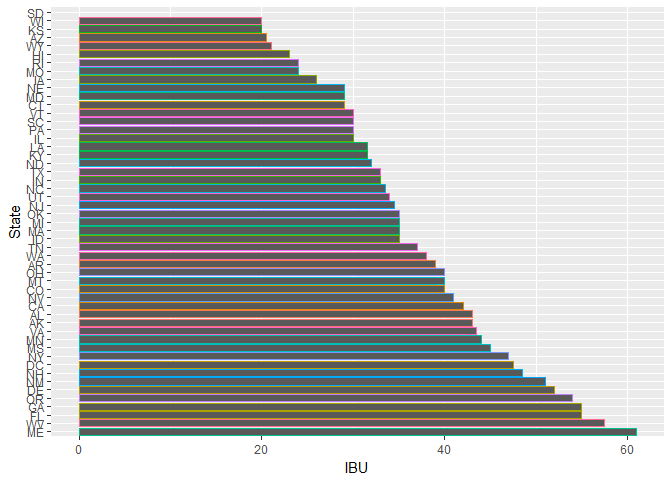
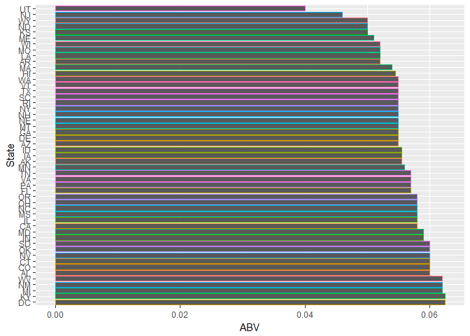

# Brewing Bros Brewery Report of the US Beer Market


## Introduction

The purpose of this study is to help "Brewing Bros"-- an international brewing company looking to expand to the United States-- assess market size and competition, and generally get a picture of the US brewing market, in order to determine their next brewery location and identify a featured beer. The data used in this study was obtained from "The National Beer and Wine Association" and includes an initial 2410 US craft beers from 558 US breweries, with information on their name, location, beer type, acolohol content, and bitterness measurement (if available).


```r
#More information on the files, their cleanup, etc. can be found in the accompanying codebook, contained in the README file, and also below, in code chunks.
```

## Data Background Information

Data for this project, obtained from The National Beer and Wine Association, which works with the largest beer distributors in the US, originated as two different datasets of the most popular and profitable beers (from data collected internally through their distribution centers as well as through distribution partners) in the US: one focused on specific beers and information about them, such as the brewery they came from, their name, and their alcohol content (Beers.csv) and a dataset of breweries who manufactured the beer, with information including where they are located (Breweries.csv). Both data sets had errors and duplications that were corrected or eliminated prior to beginning the research.

The dataset was parsed for duplicate beers and breweries, which were deleted, and misspellings of cities were corrected. After the two separate datasets were cleaned of duplicates and erroneous data lines, the two datasets were merged to create one large dataset, for the purposes of our report. This larger dataset can be found attached as an addendum to the report, labeled "master.file". 

##### Beers File Tidying

```r
#Tidying of Beers:
#read in Beers data set with correct character formatting.
Beers <- read.csv("./Data/Beers.csv", header=TRUE, fileEncoding = 'UTF-8')
```


```r
#Remove duplicate beers if ALL columns but the Beer ID are the same. 
UniqueBeers <- Beers[!duplicated(Beers[c(1,3,4,5,6,7)]),]
```


```r
#commented out, no longer needed after first run.
#code is used to creat csv file for user to manally inspect.
if(FALSE){
#Group beers by Brewery and Size
byBrewery <- split(UniqueBeers, list(UniqueBeers$Ounces, UniqueBeers$Brewery_id))

# Match First 3 Chars
for(i in 1:length(byBrewery)){
    uniTempVec <- unique(byBrewery[[i]]$Name)
    tempListVec <- character()
    for(i in 1:length(uniTempVec)){
      subTobeSearched <- substr(uniTempVec[i], 1,3)
      subTobeSearched <- paste0("^",subTobeSearched)
      tempVec <- unique(grep(subTobeSearched, uniTempVec, ignore.case = T, value = T))
      if(length(tempVec) > 1){
        tempListVec <- c(tempListVec, paste(" ", tempVec, collapse = " "))
      }
    }

    unitempListVec <- unique(tempListVec)
    for(i in 1:length(unitempListVec)){
      temp2Vec <- as.vector(unlist(strsplit(trimws(unitempListVec[i], "l"), "   ")))
      if(length(temp2Vec) > 1){
        for(i in 1:length(temp2Vec)){
          cat(temp2Vec[i], file = "./First3matches.csv", append = T)
          if(i != length(temp2Vec)){
            cat(", ", file = "./First3matches.csv", append = T)
          }  
        }
        cat("\n", file = "./First3matches.csv", append = T)
      }
    }
  }

# Match Last 3 chars
  for(i in 1:length(byBrewery)){
    uniTempVec <- as.character(unique(byBrewery[[i]]$Name))
    tempListVec <- character()
    for(i in 1:length(uniTempVec)){
      subTobeSearched <- substr(uniTempVec[i], nchar(uniTempVec[i]) - 3, nchar(uniTempVec[i]))
      subTobeSearched <- paste0(subTobeSearched, "$")
      tempVec <- unique(grep(subTobeSearched, uniTempVec, ignore.case = T, value = T))
      if(length(tempVec) > 1){
        tempListVec <- c(tempListVec, paste(" ", tempVec, collapse = " "))
      }
    }

    unitempListVec <- unique(tempListVec)
    for(i in 1:length(unitempListVec)){
      temp2Vec <- as.vector(unlist(strsplit(trimws(unitempListVec[i], "l"), "   ")))
      if(length(temp2Vec) > 1){
        for(i in 1:length(temp2Vec)){
          cat(temp2Vec[i], file = "./Last3matches.csv", append = T)
          if(i != length(temp2Vec)){
            cat(", ", file = "./Last3matches.csv", append = T)
          }  
        }
        cat("\n", file = "./Last3matches.csv", append = T)
      }
    }
  }
}
```


```r
#Removed beers with identical ABU, IBU, Brewery_id, Ounces but slight differences in name. 
#These were found by user through manual inspection of csv files obtained from codes above.
UniqueBeers <- subset(UniqueBeers, Name != "Ranger IPA (Current)")
UniqueBeers <- subset(UniqueBeers, Name != "Shift (1)")
UniqueBeers <- subset(UniqueBeers, Name != "Point Special (Current)")
UniqueBeers <- subset(UniqueBeers, Name != "Cherry Ale (1)")
UniqueBeers <- subset(UniqueBeers, Name != "Pleasure Town")
UniqueBeers <- subset(UniqueBeers, Name != "Farmer Ted's Cream Ale")
UniqueBeers <- subset(UniqueBeers, Name != "Dry Cider")
UniqueBeers <- subset(UniqueBeers, Name != "Abbey's Single (2015- )")
UniqueBeers <- subset(UniqueBeers, Name != "Triomphe")
UniqueBeers <- subset(UniqueBeers, Name != "Bender")
UniqueBeers <- subset(UniqueBeers, Name != "Hipster Ale (Westbrook Brewing)")

#rename Hipster Ale (Two Roads Brewing) to Hipster Ale; Two Roads Brewing does not brew Hipster Ale
levels(UniqueBeers$Name)[levels(UniqueBeers$Name) == "Hipster Ale (Two Roads Brewing)"] = "Hipster Ale"
```

```r
#Add code to change Brewery_ID column to match the Brews file and create CSV output of clean data.
colnames(UniqueBeers)[colnames(UniqueBeers)=="Brewery_id"] <- "Brew_ID"
```

```r
#Rename missing values / blanks to NA for Style Column.
UniqueBeers$Style[UniqueBeers$Style == ""] <- NA

#Write Clean File
write.csv(UniqueBeers, file="./Data/CleanedBeerData.csv", row.names = F)
```

##### Breweries File Tidying

```r
#Tidying Breweries.csv Section. Completed by Rajat and Andy
#First inspect the State column.  We listed out the States and got the count for each.  If observation > 50, we investigated further by examining all the States with a count of 1 (DC, ND, SD, WV).  In this case, there was 51 States and confirmed the 51st was DC which is acceptable.  All abbreviations in State column is valid.
breweries <- read.csv("./Data/Breweries.csv", header = TRUE)
str(breweries)
```

```
## 'data.frame':	558 obs. of  4 variables:
##  $ Brew_ID: int  1 2 3 4 5 6 7 8 9 10 ...
##  $ Name   : Factor w/ 551 levels "10 Barrel Brewing Company",..: 355 12 266 319 201 136 227 477 59 491 ...
##  $ City   : Factor w/ 384 levels "Abingdon","Abita Springs",..: 228 200 122 299 300 62 91 48 152 136 ...
##  $ State  : Factor w/ 51 levels " AK"," AL"," AR",..: 24 18 20 5 5 41 6 23 23 23 ...
```

```r
summary(breweries)
```

```
##     Brew_ID                           Name           City    
##  Min.   :  1.0   Blackrocks Brewery     :  2   Portland: 17  
##  1st Qu.:140.2   Blue Mountain Brewery  :  2   Boulder :  9  
##  Median :279.5   Lucette Brewing Company:  2   Chicago :  9  
##  Mean   :279.5   Oskar Blues Brewery    :  2   Seattle :  9  
##  3rd Qu.:418.8   Otter Creek Brewing    :  2   Austin  :  8  
##  Max.   :558.0   Sly Fox Brewing Company:  2   Denver  :  8  
##                  (Other)                :546   (Other) :498  
##      State    
##   CO    : 47  
##   CA    : 39  
##   MI    : 32  
##   OR    : 29  
##   TX    : 28  
##   PA    : 25  
##  (Other):358
```

```r
table(breweries$State)
```

```
## 
##  AK  AL  AR  AZ  CA  CO  CT  DC  DE  FL  GA  HI  IA  ID  IL  IN  KS  KY 
##   7   3   2  11  39  47   8   1   2  15   7   4   5   5  18  22   3   4 
##  LA  MA  MD  ME  MI  MN  MO  MS  MT  NC  ND  NE  NH  NJ  NM  NV  NY  OH 
##   5  23   7   9  32  12   9   2   9  19   1   5   3   3   4   2  16  15 
##  OK  OR  PA  RI  SC  SD  TN  TX  UT  VA  VT  WA  WI  WV  WY 
##   6  29  25   5   4   1   3  28   4  16  10  23  20   1   4
```


```r
#In this section, looking to clean up the "City" column.  Still looking for a more elequent code but for now creating subsets for each letter and visually identifying misspellings, abbreviations, and/or punctuations.  Rajat to research a function that creates a subset of cities by subsetting cities with the same 3 letter string.
unique(breweries[grep("[.]", breweries$City), "City"])
```

```
## [1] St. Paul     Mt. Airy     St. John's   Mt. Pleasant
## 384 Levels: Abingdon Abita Springs Ada Afton Airway Heights ... York
```

```r
unique(breweries[grep("^[Mm].*", breweries$City), "City"])
```

```
##  [1] Minneapolis        Marquette          Martinsville      
##  [4] Michigan City      Mishawaka          Murphysboro       
##  [7] Manhattan          Mt. Airy           Madison           
## [10] Morganton          Milwaukee          Monroe            
## [13] Middleton          Middleburg Heights Memphis           
## [16] Mount Pleasant     Middlebury         Montauk           
## [19] Mill Valley        Meridian           Meadville         
## [22] Missoula           Monument           Midvale           
## [25] Mustang            Midwest City       Menominee         
## [28] Manheim            Mt. Pleasant       Miami             
## [31] Moab               Macon              Medford           
## [34] Menominie          Minnetonka         Marietta          
## [37] Mooresville        Marlborough        Myrtle Beach      
## [40] Mammoth Lakes     
## 384 Levels: Abingdon Abita Springs Ada Afton Airway Heights ... York
```

```r
unique(breweries[grep("^[Ss].*", breweries$City), "City"])
```

```
##  [1] San Diego           San Francisco       South Lyon         
##  [4] Seven Points        Stevens Point       St. Paul           
##  [7] Saint Louis         San Antonio         St Petersburg      
## [10] Sheridan            St Mary's           St Paul            
## [13] Springdale          Sisters             Salt Lake City     
## [16] Shelburne           Spring Lake         Springfield        
## [19] Seattle             Spearfish           Stillwater         
## [22] Stamford            Southampton         Santa Cruz         
## [25] Somerset Center     South Austin        Shreveport         
## [28] South Deerfield     South Burlington    St. John's         
## [31] Santee              South Bend          San Luis Obispo    
## [34] Shelbyville         Santa Fe            Sacramento         
## [37] Savannah            Slippery Rock       Stratford          
## [40] Soldotna            South San Francisco Spirit Lake        
## [43] Sheffield           Silverton           Stevensville       
## [46] Smithton           
## 384 Levels: Abingdon Abita Springs Ada Afton Airway Heights ... York
```


```r
#Data Exploration Done, Cleaning begins   
BrDF <- read.csv("./Data/Breweries.csv", header = T, stringsAsFactors = F)
# First find and substitute any abbreviations symbols as "." with full form. Ex St. would be replaced
# with Saint, Mt. would be replaced with Mount etc
grep("[[:punct:]]",BrDF$City, value = T)
```

```
## [1] "St. Paul"      "Mt. Airy"      "Wilkes-Barre"  "St Mary's"    
## [5] "St. John's"    "Fuquay-Varina" "Mt. Pleasant"  "O'Fallon"
```

```r
grep("[[:punct:][:blank:]]+",BrDF$City, value = T)
```

```
##   [1] "San Diego"           "San Francisco"       "Grand Rapids"       
##   [4] "Grand Rapids"        "Comstock Park"       "South Lyon"         
##   [7] "Grand Rapids"        "Michigan City"       "Seven Points"       
##  [10] "Kansas City"         "Stevens Point"       "San Diego"          
##  [13] "San Francisco"       "Dripping Springs"    "East Fairfield"     
##  [16] "Paso Robles"         "St. Paul"            "Saint Louis"        
##  [19] "Brooklyn Center"     "San Antonio"         "St Petersburg"      
##  [22] "Mt. Airy"            "San Francisco"       "Fort Collins"       
##  [25] "Traverse City"       "East Windsor"        "Wilkes-Barre"       
##  [28] "San Diego"           "Lone Tree"           "North Woodstock"    
##  [31] "St Mary's"           "Stevens Point"       "St Paul"            
##  [34] "Cold Spring"         "Baton Rouge"         "Salt Lake City"     
##  [37] "Fort Worth"          "Traverse City"       "West Chester"       
##  [40] "Garden City"         "White Salmon"        "New Orleans"        
##  [43] "Fort Worth"          "Oklahoma City"       "Spring Lake"        
##  [46] "Paw Paw"             "Oklahoma City"       "San Antonio"        
##  [49] "San Diego"           "Farmers Branch"      "Cherry Hill"        
##  [52] "Atlantic Highlands"  "Middleburg Heights"  "Lake Geneva"        
##  [55] "Lake Havasu City"    "Los Angeles"         "College Station"    
##  [58] "Plant City"          "Santa Cruz"          "Somerset Center"    
##  [61] "South Austin"        "Mount Pleasant"      "Bridgewater Corners"
##  [64] "South Deerfield"     "Mill Valley"         "Ridgefield Park"    
##  [67] "Port Clinton"        "San Diego"           "Idaho Springs"      
##  [70] "Salt Lake City"      "South Burlington"    "Virginia Beach"     
##  [73] "Garden City"         "San Francisco"       "Black Mountain"     
##  [76] "Saint Louis"         "Diamond Springs"     "St. John's"         
##  [79] "Boynton Beach"       "South Bend"          "Green Bay"          
##  [82] "San Luis Obispo"     "Fuquay-Varina"       "Lake Barrington"    
##  [85] "San Francisco"       "Buena Vista"         "Midwest City"       
##  [88] "Mt. Pleasant"        "Airway Heights"      "Santa Fe"           
##  [91] "Ann Arbor"           "Eau Claire"          "San Diego"          
##  [94] "Stevens Point"       "Saint Louis"         "Slippery Rock"      
##  [97] "Santa Cruz"          "Traverse City"       "Royal Oak"          
## [100] "Fort Collins"        "O'Fallon"            "Vadnais Heights"    
## [103] "Half Moon Bay"       "San Diego"           "South San Francisco"
## [106] "Jacksonville Beach"  "Tampa Bay"           "San Antonio"        
## [109] "Spirit Lake"         "Gig Harbor"          "Des Moines"         
## [112] "New York"            "Green Bay"           "Fort Wayne"         
## [115] "Lake Havasu City"    "Colorado Springs"    "San Diego"          
## [118] "Myrtle Beach"        "Santa Cruz"          "New York"           
## [121] "Eau Claire"          "Abita Springs"       "Mammoth Lakes"      
## [124] "Battle Creek"        "North Conway"
```

```r
grep("^..[[:punct:][:blank:]]+",BrDF$City, value = T)
```

```
## [1] "St. Paul"      "St Petersburg" "Mt. Airy"      "St Mary's"    
## [5] "St Paul"       "St. John's"    "Mt. Pleasant"
```

```r
BrDF$City <- gsub("^St[[:punct:][:blank:]]+","Saint ",BrDF$City)
BrDF$City <- gsub("^Mt[[:punct:][:blank:]]+","Mount ",BrDF$City)

# The purpose of below code is to catch cities that could be misspelled or are located in 
# different state than what got entered by mistake.
# The logic is that if City Name starts with same characters, and later gets off by few charcters
# then the following code would catch such cities and list their states. If Thier States and Brewery Name
# Also Matches then these could be misspellings. The same loop would be repeated to match cities that end
# with same characters as these could be misspelled in their starting characters.

# Loop through every Unique city in City column, extract its first 3 characters,
# append ^ in front of it so as to make RegEx for the search. Search for all other
# Cities that start with Same 3 Characters. If more than 1 matching City is found
# append that city to running Vector(kind of appending to List)
uniTempVec <- unique(BrDF$City)
tempListVec <- character()
for(i in 1:length(uniTempVec)){
  subTobeSearched <- substr(uniTempVec[i], 1,3)
  subTobeSearched <- paste0("^",subTobeSearched)
  tempVec <- unique(grep(subTobeSearched, uniTempVec, ignore.case = T, value = T))
  if(length(tempVec) > 1){
    tempListVec <- c(tempListVec, paste(" ", tempVec, collapse = " "))
  }
}

# List the States for such cities with matching first 3 chars. If state is also same,
# manually inspect brewery Names, to find potential misspellings.
unitempListVec <- unique(tempListVec)
temp3Vec <- character()
for(i in 1:length(unitempListVec)){
  temp3Vec <- character()
  temp2Vec <- as.vector(unlist(strsplit(trimws(unitempListVec[i], "l"), "   ")))
  for (j in 1:length(temp2Vec)){
    temp3Vec <- c(temp3Vec,unique(as.character(BrDF[BrDF$City == temp2Vec[j], "State"])))
  }
  if(length(unique(temp3Vec)) != length(temp3Vec)){
    print(as.data.frame(sapply(temp2Vec, function(x) unique(BrDF[BrDF$City == x, "State"]))))
  }
}
```

```
##             sapply(temp2Vec, function(x) unique(BrDF[BrDF$City == x, "State"]))
## Minneapolis                                                                  MN
## Minnetonka                                                                   MN
##                 sapply(temp2Vec, function(x) unique(BrDF[BrDF$City == x, "State"]))
## San Diego                                                                        CA
## San Francisco                                                                    CA
## San Antonio                                                                      TX
## Santa Cruz                                                                       CA
## Santee                                                                           CA
## San Luis Obispo                                                                  CA
## Santa Fe                                                                         NM
##   Marquette Martinsville Marietta Marlborough
## 1        MI           IN       GA          MA
## 2        MA           IN       GA          MA
##                 sapply(temp2Vec, function(x) unique(BrDF[BrDF$City == x, "State"]))
## Brooklyn                                                                         NY
## Brooklyn Center                                                                  MN
## Broomfield                                                                       CO
## Bronx                                                                            NY
##              sapply(temp2Vec, function(x) unique(BrDF[BrDF$City == x, "State"]))
## Westerly                                                                      RI
## Weston                                                                        MO
## West Chester                                                                  PA
## Westminster                                                                   MA
## Westfield                                                                     MA
##   Newport New.Orleans Newburgh New.York Newburyport
## 1      RI          LA       NY       NY          MA
## 2      OR          LA       NY       NY          MA
##           sapply(temp2Vec, function(x) unique(BrDF[BrDF$City == x, "State"]))
## Lone Tree                                                                  CO
## Longmont                                                                   CO
##                 sapply(temp2Vec, function(x) unique(BrDF[BrDF$City == x, "State"]))
## North Woodstock                                                                  NH
## Norfolk                                                                          VA
## Northamtpon                                                                      MA
## North Conway                                                                     NH
##   Ashland Ashburn Asheville
## 1      VA      VA        NC
## 2      OR      VA        NC
##           sapply(temp2Vec, function(x) unique(BrDF[BrDF$City == x, "State"]))
## Tampa                                                                      FL
## Tampa Bay                                                                  FL
##           sapply(temp2Vec, function(x) unique(BrDF[BrDF$City == x, "State"]))
## Lansdale                                                                   PA
## Lancaster                                                                  PA
##   Jackson Jacksonville Jacksonville.Beach
## 1      WY           FL                 FL
## 2      MS           FL                 FL
##           sapply(temp2Vec, function(x) unique(BrDF[BrDF$City == x, "State"]))
## Menominee                                                                  WI
## Menominie                                                                  WI
```


```r
## Do corrections to City Names or State Names, If above code find issues.
# Corrections 
BrDF[BrDF$City == "Menominee", 'City'] <- "Menomonie"
BrDF[BrDF$City == "Menominie", 'City'] <- "Menomonie"
# Remove leading white space from State col
BrDF$State <- trimws(BrDF$State, "l")
# City Marquette is in MI and not MA
BrDF[BrDF$City == "Marquette" & BrDF$State == "MA", 'State'] <- "MI"
```


```r
# Now, repeat the above process to find potential missppelled cities based upon 
# Match of Last 3 Chars
uniTempVec <- unique(BrDF$City)
tempListVec <- character()
for(i in 1:length(uniTempVec)){
  subTobeSearched <- substr(uniTempVec[i], nchar(uniTempVec[i]) - 3, nchar(uniTempVec[i]))
  subTobeSearched <- paste0(subTobeSearched,"$")
  tempVec <- unique(grep(subTobeSearched, uniTempVec,ignore.case = T, value = T))
  if(length(tempVec) > 1){
    tempListVec <- c(tempListVec, paste(" ", tempVec, collapse = " "))
  }
}

unitempListVec <- unique(tempListVec)
temp3Vec <- character()
for(i in 1:length(unitempListVec)){
  temp3Vec <- character()
  temp2Vec <- as.vector(unlist(strsplit(trimws(unitempListVec[i], "l"), "   ")))
  for (j in 1:length(temp2Vec)){
    temp3Vec <- c(temp3Vec,unique(as.character(BrDF[BrDF$City == temp2Vec[j], "State"])))
  }
  if(length(unique(temp3Vec)) != length(temp3Vec)){
    print(as.data.frame(sapply(temp2Vec, function(x) unique(BrDF[BrDF$City == x, "State"]))))
  }
}
```

```
##   Louisville Evansville Martinsville Bargersville Troutville Roseville
## 1         KY         IN           IN           IN         VA        MN
## 2         KY         IN           IN           IN         VA        MN
##   Warrenville Phoenixville Boonville Waynesville Charlottesville
## 1          IL           PA        CA          NC              VA
## 2          IL           PA        CA          NC              VA
##   Greenville Danville Woodinville Nashville Meadville Shelbyville
## 1         SC       PA          WA        TN        PA          IN
## 2         DE       PA          WA        TN        PA          IN
##   Jacksonville Hudsonville Huntsville Biglerville Asheville Gainesville
## 1           FL          MI         AL          PA        NC          FL
## 2           FL          MI         AL          PA        NC          FL
##   Knoxville Stevensville Mooresville Libertyville Garrattsville
## 1        IA           MT          NC           IL            NY
## 2        IA           MT          NC           IL            NY
##                     sapply(temp2Vec, function(x) unique(BrDF[BrDF$City == x, "State"]))
## San Francisco                                                                        CA
## South San Francisco                                                                  CA
##   Holland Portland Pineland Ashland Loveland Cleveland Lockland Cortland
## 1      MI       ME       ME      VA       CO        OH       OH       NE
## 2      MI       OR       ME      OR       CO        OH       OH       NE
##   Plainfield East.Fairfield Bloomfield Springfield Broomfield
## 1         IN             VT         CT          MO         CO
## 2         IN             VT         CT          OR         CO
##   South.Deerfield Westfield Sheffield
## 1              MA        MA        MA
## 2              MA        MA        MA
##                  sapply(temp2Vec, function(x) unique(BrDF[BrDF$City == x, "State"]))
## Michigan City                                                                     IN
## Kansas City                                                                       MO
## Traverse City                                                                     MI
## Salt Lake City                                                                    UT
## Garden City                                                                       ID
## Oklahoma City                                                                     OK
## Lake Havasu City                                                                  AZ
## Plant City                                                                        FL
## Midwest City                                                                      OK
##                  sapply(temp2Vec, function(x) unique(BrDF[BrDF$City == x, "State"]))
## Dripping Springs                                                                  TX
## Idaho Springs                                                                     CO
## Diamond Springs                                                                   CA
## Colorado Springs                                                                  CO
## Abita Springs                                                                     LA
##           sapply(temp2Vec, function(x) unique(BrDF[BrDF$City == x, "State"]))
## Lemont                                                                     IL
## Longmont                                                                   CO
## Claremont                                                                  CA
## Belmont                                                                    CA
##   Bloomington Lexington Washington South.Burlington Wilmington Burlington
## 1          IL        KY         DC               VT         DE         VT
## 2          IN        VA         DC               VT         DE         VT
##   Lake.Barrington Arrington Covington
## 1              IL        VA        LA
## 2              IL        VA        LA
##              sapply(temp2Vec, function(x) unique(BrDF[BrDF$City == x, "State"]))
## Austin                                                                        TX
## South Austin                                                                  TX
##   West.Chester Rochester Gloucester Westminster Worcester Leominster
## 1           PA        MI         MA          MA        MA         MA
## 2           PA        NY         MA          MA        MA         MA
##   Lancaster
## 1        PA
## 2        PA
##            sapply(temp2Vec, function(x) unique(BrDF[BrDF$City == x, "State"]))
## Nellysford                                                                  VA
## Stamford                                                                    CT
## Stratford                                                                   CT
## Medford                                                                     OR
##            sapply(temp2Vec, function(x) unique(BrDF[BrDF$City == x, "State"]))
## Waterbury                                                                   VT
## Middlebury                                                                  VT
##                    sapply(temp2Vec, function(x) unique(BrDF[BrDF$City == x, "State"]))
## Virginia Beach                                                                      VA
## Boynton Beach                                                                       FL
## Jacksonville Beach                                                                  FL
## Myrtle Beach                                                                        SC
```

```r
# No corrections after last 3 match

# Repeating above code to find cities with initial 2 chars match
uniTempVec <- unique(BrDF$City)
tempListVec <- character()
for(i in 1:length(uniTempVec)){
  subTobeSearched <- substr(uniTempVec[i], 1,2)
  subTobeSearched <- paste0("^",subTobeSearched)
  tempVec <- unique(grep(subTobeSearched, uniTempVec, ignore.case = T, value = T))
  if(length(tempVec) > 1){
    tempListVec <- c(tempListVec, paste(" ", tempVec, collapse = " "))
  }
}

unitempListVec <- unique(tempListVec)
temp3Vec <- character()
for(i in 1:length(unitempListVec)){
  temp3Vec <- character()
  temp2Vec <- as.vector(unlist(strsplit(trimws(unitempListVec[i], "l"), "   ")))
  for (j in 1:length(temp2Vec)){
    temp3Vec <- c(temp3Vec,unique(as.character(BrDF[BrDF$City == temp2Vec[j], "State"])))
  }
  if(length(unique(temp3Vec)) != length(temp3Vec)){
    print(as.data.frame(sapply(temp2Vec, function(x) unique(BrDF[BrDF$City == x, "State"]))))
  }
}
```

```
##                    sapply(temp2Vec, function(x) unique(BrDF[BrDF$City == x, "State"]))
## Minneapolis                                                                         MN
## Michigan City                                                                       IN
## Mishawaka                                                                           IN
## Milwaukee                                                                           WI
## Middleton                                                                           WI
## Middleburg Heights                                                                  OH
## Middlebury                                                                          VT
## Mill Valley                                                                         CA
## Missoula                                                                            MT
## Midvale                                                                             UT
## Midwest City                                                                        OK
## Miami                                                                               FL
## Minnetonka                                                                          MN
##             sapply(temp2Vec, function(x) unique(BrDF[BrDF$City == x, "State"]))
## Louisville                                                                   KY
## Lombard                                                                      IL
## Lowell                                                                       MA
## Lone Tree                                                                    CO
## Loveland                                                                     CO
## Longmont                                                                     CO
## Los Angeles                                                                  CA
## Lockland                                                                     OH
##                  sapply(temp2Vec, function(x) unique(BrDF[BrDF$City == x, "State"]))
## San Diego                                                                         CA
## San Francisco                                                                     CA
## Saint Paul                                                                        MN
## Saint Louis                                                                       MO
## San Antonio                                                                       TX
## Saint Petersburg                                                                  FL
## Saint Mary's                                                                      PA
## Salt Lake City                                                                    UT
## Santa Cruz                                                                        CA
## Saint John's                                                                      MI
## Santee                                                                            CA
## San Luis Obispo                                                                   CA
## Santa Fe                                                                          NM
## Sacramento                                                                        CA
## Savannah                                                                          GA
##                     sapply(temp2Vec, function(x) unique(BrDF[BrDF$City == x, "State"]))
## Bridgman                                                                             MI
## Brooklyn                                                                             NY
## Brooklyn Center                                                                      MN
## Broomfield                                                                           CO
## Bridgewater Corners                                                                  VT
## Bronx                                                                                NY
## Brevard                                                                              NC
##          sapply(temp2Vec, function(x) unique(BrDF[BrDF$City == x, "State"]))
## Holland                                                                   MI
## Hooksett                                                                  NH
## Houghton                                                                  MI
## Houston                                                                   TX
##               sapply(temp2Vec, function(x) unique(BrDF[BrDF$City == x, "State"]))
## Marquette                                                                      MI
## Martinsville                                                                   IN
## Manhattan                                                                      KS
## Madison                                                                        WI
## Manheim                                                                        PA
## Macon                                                                          GA
## Marietta                                                                       GA
## Marlborough                                                                    MA
## Mammoth Lakes                                                                  CA
##   Comstock.Park Columbus Conroe Cold.Spring Corvallis College.Station
## 1            MI       IN     TX          MN        OR              TX
## 2            MI       OH     TX          MN        OR              TX
##   Conestoga Cortland Colorado.Springs Covington
## 1        PA       NE               CO        LA
## 2        PA       NE               CO        LA
##                     sapply(temp2Vec, function(x) unique(BrDF[BrDF$City == x, "State"]))
## South Lyon                                                                           MI
## Southampton                                                                          NY
## Somerset Center                                                                      MI
## South Austin                                                                         TX
## South Deerfield                                                                      MA
## South Burlington                                                                     VT
## South Bend                                                                           IN
## Soldotna                                                                             AK
## South San Francisco                                                                  CA
##               sapply(temp2Vec, function(x) unique(BrDF[BrDF$City == x, "State"]))
## Stevens Point                                                                  WI
## Stillwater                                                                     MN
## Stamford                                                                       CT
## Stratford                                                                      CT
## Stevensville                                                                   MT
##             sapply(temp2Vec, function(x) unique(BrDF[BrDF$City == x, "State"]))
## Paso Robles                                                                  CA
## Paw Paw                                                                      MI
## Pawtucket                                                                    RI
## Papillion                                                                    NE
## Palisade                                                                     CO
## Paonia                                                                       CO
## Pacific                                                                      WA
## Patchogue                                                                    NY
## Pawcatuck                                                                    CT
##   Atlanta Athens Atlantic.Highlands
## 1      GA     OH                 NJ
## 2      GA     GA                 NJ
##   Roseville Rochester Rogers Roanoke Royal.Oak
## 1        MN        MI     AR      VA        MI
## 2        MN        NY     AR      VA        MI
##   Mount.Airy Morganton Monroe Mount.Pleasant Montauk Monument Moab
## 1         MD        NC     WI             MI      NY       CO   UT
## 2         MD        NC     WI             SC      NY       CO   UT
##   Mooresville
## 1          NC
## 2          NC
##              sapply(temp2Vec, function(x) unique(BrDF[BrDF$City == x, "State"]))
## Westerly                                                                      RI
## Weston                                                                        MO
## West Chester                                                                  PA
## Westminster                                                                   MA
## Westfield                                                                     MA
##   Newport New.Orleans Nellysford Newburgh New.York Newburyport
## 1      RI          LA         VA       NY       NY          MA
## 2      OR          LA         VA       NY       NY          MA
##                 sapply(temp2Vec, function(x) unique(BrDF[BrDF$City == x, "State"]))
## North Woodstock                                                                  NH
## Norfolk                                                                          VA
## Northamtpon                                                                      MA
## North Conway                                                                     NH
##                  sapply(temp2Vec, function(x) unique(BrDF[BrDF$City == x, "State"]))
## Laurel                                                                            MD
## Latrobe                                                                           PA
## Lansdale                                                                          PA
## Lafayette                                                                         IN
## Lake Geneva                                                                       WI
## Lake Havasu City                                                                  AZ
## Lake Barrington                                                                   IL
## Lahaina                                                                           HI
## Lakeside                                                                          MT
## Lancaster                                                                         PA
##   Ashland Astoria Ashburn Asheville Aspen
## 1      VA      OR      VA        NC    CO
## 2      OR      OR      VA        NC    CO
##             sapply(temp2Vec, function(x) unique(BrDF[BrDF$City == x, "State"]))
## Wolcott                                                                      CT
## Woodinville                                                                  WA
## Worcester                                                                    MA
## Woodbridge                                                                   CT
##           sapply(temp2Vec, function(x) unique(BrDF[BrDF$City == x, "State"]))
## Tampa                                                                      FL
## Talkeetna                                                                  AK
## Tampa Bay                                                                  FL
## Tacoma                                                                     WA
##   Sisters Silverton
## 1      OR        OR
## 2      OR        CO
##              sapply(temp2Vec, function(x) unique(BrDF[BrDF$City == x, "State"]))
## Phoenix                                                                       AZ
## Phoenixville                                                                  PA
## Philadelphia                                                                  PA
##           sapply(temp2Vec, function(x) unique(BrDF[BrDF$City == x, "State"]))
## Cambridge                                                                  MA
## Canton                                                                     MA
## Carlsbad                                                                   CA
##   Jackson Jacksonville Jacksonville.Beach
## 1      WY           FL                 FL
## 2      MS           FL                 FL
```

```r
# No significant findings when compared to 3 char Match, stopping with this City Column cleaning.
```


```r
# List any duplicate Rows based upon Name","City","State" columns.
BrDF[duplicated(BrDF[,c("Name","City","State")]), ]
```

```
##     Brew_ID                    Name       City State
## 96       96      Blackrocks Brewery  Marquette    MI
## 139     139  Summit Brewing Company Saint Paul    MN
## 457     457 Lucette Brewing Company  Menomonie    WI
```

```r
# Remove Dups, if needed
#BrDF <- BrDF[!duplicated(BrDF[,c("Name","City","State")]), ]
```


```r
## Look for duplicates in Brewery Name
as.data.frame(table(BrDF$Name))[as.data.frame(table(BrDF$Name))$Freq > 1, ]
```

```
##                        Var1 Freq
## 71       Blackrocks Brewery    2
## 75    Blue Mountain Brewery    2
## 298 Lucette Brewing Company    2
## 368     Oskar Blues Brewery    2
## 370     Otter Creek Brewing    2
## 443 Sly Fox Brewing Company    2
## 466  Summit Brewing Company    2
```

```r
## Match first 3, same logic that was done to find misspelled cities.
uniTempVec <- unique(BrDF$Name)
tempListVec <- character()
for(i in 1:length(uniTempVec)){
  subTobeSearched <- substr(uniTempVec[i], 1,3)
  subTobeSearched <- paste0("^",subTobeSearched)
  tempVec <- unique(grep(subTobeSearched, uniTempVec,ignore.case = T, value = T))
  if(length(tempVec) > 1){
    tempListVec <- c(tempListVec, paste(" ", tempVec, collapse = " "))
  }
}

unitempListVec <- unique(tempListVec)
temp3Vec <- character()
for(i in 1:length(unitempListVec)){
  temp3Vec <- character()
  temp2Vec <- trimws(as.vector(unlist(strsplit(trimws(unitempListVec[i], "l"), "   "))), "l")
  for (j in 1:length(temp2Vec)){
    temp3Vec <- c(temp3Vec,unique(paste(BrDF[BrDF$Name == temp2Vec[j], "City"], BrDF[BrDF$Name == temp2Vec[j], "State"], sep = "+")))
  }
  if(length(unique(temp3Vec)) != length(temp3Vec)){
    print(as.data.frame(sapply(temp2Vec, function(x) paste(BrDF[BrDF$Name == x, "City"], BrDF[BrDF$Name == x, "State"], sep = "+"))))
  }
}
```

```
##                           sapply(temp2Vec, function(x) paste(BrDF[BrDF$Name == x, "City"], BrDF[BrDF$Name == x, "State"], sep = "+"))
## Against the Grain Brewery                                                                                               Louisville+KY
## Against The Grain Brewery                                                                                               Louisville+KY
##                                   sapply(temp2Vec, function(x) paste(BrDF[BrDF$Name == x, "City"], BrDF[BrDF$Name == x, "State"], sep = "+"))
## Great Divide Brewing Company                                                                                                        Denver+CO
## Grey Sail Brewing Company                                                                                                         Westerly+RI
## Greenbrier Valley Brewing Company                                                                                                Lewisburg+WV
## Great Crescent Brewery                                                                                                              Aurora+IN
## Great Raft Brewing Company                                                                                                      Shreveport+LA
## Great River Brewery                                                                                                              Davenport+IA
## Grey Sail Brewing of Rhode Island                                                                                                 Westerly+RI
## Green Room Brewing                                                                                                            Jacksonville+FL
## Great Northern Brewing Company                                                                                                   Whitefish+MT
##                                 sapply(temp2Vec, function(x) paste(BrDF[BrDF$Name == x, "City"], BrDF[BrDF$Name == x, "State"], sep = "+"))
## The Mitten Brewing Company                                                                                                  Grand Rapids+MI
## The Dudes' Brewing Company                                                                                                      Torrance+CA
## The Lion Brewery                                                                                                            Wilkes-Barre+PA
## The Brewer's Art                                                                                                               Baltimore+MD
## The Alchemist                                                                                                                  Waterbury+VT
## The Just Beer Project                                                                                                         Burlington+VT
## The Bronx Brewery                                                                                                                  Bronx+NY
## The Traveler Beer Company                                                                                                     Burlington+VT
## The Right Brain Brewery                                                                                                    Traverse City+MI
## The Black Tooth Brewing Company                                                                                                 Sheridan+WY
## The Manhattan Brewing Company                                                                                                   New York+NY
##                               sapply(temp2Vec, function(x) paste(BrDF[BrDF$Name == x, "City"], BrDF[BrDF$Name == x, "State"], sep = "+"))
## Hopworks Urban Brewery                                                                                                        Portland+OR
## Hops & Grains Brewing Company                                                                                                   Austin+TX
## Hop Valley Brewing Company                                                                                                 Springfield+OR
## Hop Farm Brewing Company                                                                                                    Pittsburgh+PA
## Hops & Grain Brewery                                                                                                            Austin+TX
##                              sapply(temp2Vec, function(x) paste(BrDF[BrDF$Name == x, "City"], BrDF[BrDF$Name == x, "State"], sep = "+"))
## Goose Island Brewing Company                                                                                                  Chicago+IL
## Goodlife Brewing Co.                                                                                                             Bend+OR
## Goose Island Brewery Company                                                                                                  Chicago+IL
## Good Life Brewing Company                                                                                                        Bend+OR
## Good People Brewing Company                                                                                                Birmingham+AL
##                                sapply(temp2Vec, function(x) paste(BrDF[BrDF$Name == x, "City"], BrDF[BrDF$Name == x, "State"], sep = "+"))
## Catawba Valley Brewing Company                                                                                                Morganton+NC
## Catawba Island Brewing                                                                                                     Port Clinton+OH
## Catawba Brewing Company                                                                                                       Morganton+NC
##                              sapply(temp2Vec, function(x) paste(BrDF[BrDF$Name == x, "City"], BrDF[BrDF$Name == x, "State"], sep = "+"))
## Angry Minnow                                                                                                                  Hayward+WI
## Angry Orchard Cider Company                                                                                                Cincinnati+OH
## Angry Minnow Brewing Company                                                                                                  Hayward+WI
```


```r
# Do corrections here
BrDF[BrDF$Name == "Against the Grain Brewery", "Name"] <- "Against The Grain Brewery"
BrDF[BrDF$Name == "Grey Sail Brewing of Rhode Island", "Name"] <- "Grey Sail Brewing Company"
BrDF[BrDF$Name == "Hops & Grains Brewing Company", "Name"] <- "Hops & Grain Brewery"
BrDF[BrDF$Name == "Goose Island Brewery Company", "Name"] <- "Goose Island Brewing Company"
BrDF[BrDF$Name == "Goodlife Brewing Co.", "Name"] <- "Good Life Brewing Company"
BrDF[BrDF$Name == "Catawba Brewing Company", "Name"] <- "Catawba Valley Brewing Company"
BrDF[BrDF$Name == "Angry Minnow", "Name"] <- "Angry Minnow Brewing Company"

#Write Clean File
write.csv(BrDF, file = "./Data/CleanedBreweryData.csv", row.names = F)
```

### What information do we have to work with?
The two separate files, beers and breweries, were merged into one large dataset. Some of the observations are seen below.  The data gathered includes... 


```r
#Q2 - Merge Beer and Breweries files by Brew_ID (Assumes Beers.csv file has renamed Brewery_ID to Brew_ID) and prints the first/last 6 observations.
beers <- read.csv("./Data/CleanedBeerData.csv", header = TRUE)
breweries <- read.csv("./Data/CleanedBreweryData.csv", header = TRUE)
master.file <- Reduce(function(beers, breweries) merge(beers, breweries, by="Brew_ID"), list(beers, breweries))
names(master.file) <- c("Brewery_id", "Beer_name", "Beer_id", "ABV", "IBU", "Style", "Ounces", "Brewery_name", "City", "State")
write.csv(master.file, file = "./Data/masterfile.csv", row.names = FALSE)
head(master.file,6)
```

```
##   Brewery_id     Beer_name Beer_id   ABV IBU
## 1          1  Get Together    2692 0.045  50
## 2          1 Maggie's Leap    2691 0.049  26
## 3          1    Wall's End    2690 0.048  19
## 4          1       Pumpion    2689 0.060  38
## 5          1    Stronghold    2688 0.060  25
## 6          1   Parapet ESB    2687 0.056  47
##                                 Style Ounces       Brewery_name
## 1                        American IPA     16 NorthGate Brewing 
## 2                  Milk / Sweet Stout     16 NorthGate Brewing 
## 3                   English Brown Ale     16 NorthGate Brewing 
## 4                         Pumpkin Ale     16 NorthGate Brewing 
## 5                     American Porter     16 NorthGate Brewing 
## 6 Extra Special / Strong Bitter (ESB)     16 NorthGate Brewing 
##          City State
## 1 Minneapolis    MN
## 2 Minneapolis    MN
## 3 Minneapolis    MN
## 4 Minneapolis    MN
## 5 Minneapolis    MN
## 6 Minneapolis    MN
```

```r
tail(master.file,6)
```

```
##      Brewery_id                 Beer_name Beer_id   ABV IBU
## 2361        556             Pilsner Ukiah      98 0.055  NA
## 2362        557  Heinnieweisse Weissebier      52 0.049  NA
## 2363        557           Snapperhead IPA      51 0.068  NA
## 2364        557         Moo Thunder Stout      50 0.049  NA
## 2365        557         Porkslap Pale Ale      49 0.043  NA
## 2366        558 Urban Wilderness Pale Ale      30 0.049  NA
##                        Style Ounces                  Brewery_name
## 2361         German Pilsener     12         Ukiah Brewing Company
## 2362              Hefeweizen     12       Butternuts Beer and Ale
## 2363            American IPA     12       Butternuts Beer and Ale
## 2364      Milk / Sweet Stout     12       Butternuts Beer and Ale
## 2365 American Pale Ale (APA)     12       Butternuts Beer and Ale
## 2366        English Pale Ale     12 Sleeping Lady Brewing Company
##               City State
## 2361         Ukiah    CA
## 2362 Garrattsville    NY
## 2363 Garrattsville    NY
## 2364 Garrattsville    NY
## 2365 Garrattsville    NY
## 2366     Anchorage    AK
```

### Are there any obstacles with the data we're using?
Once the data was cleaned and combined, there were still some missing data (or data showing as "NA" or "incomplete".  Not all breweries keep all of these statistics on all of their artisan beers, especially IBU. These missing data include 997 IBU ratings and 62 ABV marks, as seen below. 

Only about 2.6% of the beers we have are missing information on alcohol by volume, although roughly 40% of the beers are missing information about their bitterness, using the International Bitterness Unit Scale. This still leaves us with a majority of our beers with complete information.


```r
#Q3 - Summing the NA's for each column
colSums(is.na(master.file))
```

```
##   Brewery_id    Beer_name      Beer_id          ABV          IBU 
##            0            0            0           62          997 
##        Style       Ounces Brewery_name         City        State 
##            5            0            0            0            0
```

```r
62/2366
```

```
## [1] 0.02620456
```

```r
997/2366
```

```
## [1] 0.4213863
```

## Beer and Brewery Quick Facts

#### How many breweries are there per state? Are there any states that stand out as having too many or too few breweries?
The 558 breweries in this dataset are spread among all 50 states and includes District of Columbia (for a total of 51). The most breweries are located in in Colorado (47), which has a booming beer market.  Other states with at least 25 breweries (all well-performing markets) include: California  (39), Michigan (33), Oregon (29), Texas (28), and Pennsylvania (25).

The states with the fewest breweries in the US also tend to be the smallest or least populated, such as Washington, D.C. (1), North Dakota (1) , South Dakota (1), West Virginia (1), Arkansas (2), Delaware (2), Mississippi (2), and Nevada (2).


```r
BrewState <-data.frame(master.file$Brewery_id, master.file$State)
UniqueBrewState <- unique(BrewState)
StatesChart <- as.data.frame(table(UniqueBrewState$master.file.State))
names(StatesChart) <- c("State", "Number_of_Breweries")
statesSort <- StatesChart[order(StatesChart$`Number_of_Breweries`),]
statesSort
```

```
##    State Number_of_Breweries
## 8     DC                   1
## 29    ND                   1
## 42    SD                   1
## 50    WV                   1
## 3     AR                   2
## 9     DE                   2
## 26    MS                   2
## 34    NV                   2
## 2     AL                   3
## 17    KS                   3
## 31    NH                   3
## 32    NJ                   3
## 43    TN                   3
## 12    HI                   4
## 18    KY                   4
## 33    NM                   4
## 41    SC                   4
## 45    UT                   4
## 51    WY                   4
## 13    IA                   5
## 14    ID                   5
## 19    LA                   5
## 30    NE                   5
## 40    RI                   5
## 37    OK                   6
## 1     AK                   7
## 11    GA                   7
## 21    MD                   7
## 7     CT                   8
## 22    ME                   9
## 25    MO                   9
## 27    MT                   9
## 47    VT                  10
## 4     AZ                  11
## 24    MN                  12
## 10    FL                  15
## 36    OH                  15
## 35    NY                  16
## 46    VA                  16
## 15    IL                  18
## 28    NC                  19
## 49    WI                  20
## 16    IN                  22
## 20    MA                  22
## 48    WA                  23
## 39    PA                  25
## 44    TX                  28
## 38    OR                  29
## 23    MI                  33
## 5     CA                  39
## 6     CO                  47
```

```r
#Add Graphic for Presentation Purposes
library(ggplot2)
StateCount <- ggplot(statesSort, aes(reorder(State, -Number_of_Breweries), Number_of_Breweries, color=State)) + geom_bar(stat = "Identity", width = .85) + labs(x = "State") + theme(legend.position = "none") + coord_flip()
StateCount
```

<!-- -->

### What is the most alcoholic (ABV) and most bitter (IBU) beer in the US?

#### Highest ABV Beer and the top and bottom ABV beers in the US:
Based on the information gathered, Colorado has the beer with the highest alcohol by volume (.128), a Belgian Quadruple Ale from Upslope Brewing Company in Boulder Colorado. The Lee Hill Series Belgian Ale is followed closely by London Balling, an English Barleywine from Against the Grain Brewery in Lousiville, Kentucky (.125), and also Csar, a Russian Imperial Stout from Tin Man Brewing Company in Evansville, Indiana (.120), another Lee Hill Series Manhattan Style Rye Ale also from Upslope in Boulder, Colorado (.104), and the 4Beans Baltic Porter from Sixpoint Craft Ales in Brooklyn, New York (.100). 

The lowest alcohol by volume beer is the Scotty K NA from Uncommon Breweries, in Santa Cruz, California, and is billed as a low-alcohol beer. The next lowest alcohol-by-volume beers are the Totally Radler from Hopworks Urban Brewery in Portland, Oregon (.027), the Bikini Beer, an American IPA from Evil Twin Brewery in Brooklyn, New York (also .027), the Summer Brew, an American Pilsner from Wodstock Inn, Station, & Brewery in North Woodstock, New Hampshire (.028), and the Rad, labeled as a Fruit/Vegetable beer, from Sixpoint Craft Ales in Brooklyn, New York.

It is interesting to note that 6 of the 20 lowest ABV beers are Ales (of varying types), with 4 Light Lagers and two Weissbiers, while in the top 20 of the highest ABV beers, there are 7 stouts (of varying types, mostly American Double/Imperial Stouts) and 3 Barleywines.

A list of the top and bottom 20 beers can be seen below. Note that the top 20 are printed in reverse order, as they are reported in ascending size.

#### The beer with the highest ABV

```r
#Q4-7 done by Tori

#print the max ABV beer (and its information) in the whole dataset
master.file[which.max(master.file$ABV),]
```

```
##     Brewery_id                                            Beer_name
## 374         52 Lee Hill Series Vol. 5 - Belgian Style Quadrupel Ale
##     Beer_id   ABV IBU            Style Ounces            Brewery_name
## 374    2565 0.128  NA Quadrupel (Quad)   19.2 Upslope Brewing Company
##        City State
## 374 Boulder    CO
```

```r
#Tori
```

#### The top 20 highest ABV beers (in reverse order)

```r
#Q4-7 done by Tori

#order all beers by ABV in ascending order, then ignrore NA's only in the ABV column
ABVall <- master.file[order(master.file$ABV),]
ABVall <- ABVall[!is.na(ABVall$ABV),]

#print the top 20 (reverse order)
tail(ABVall, 20)
```

```
##      Brewery_id                                            Beer_name
## 994         167                              Ten Fidy Imperial Stout
## 996         167                                   GUBNA Imperial IPA
## 1247        223                                              Epitome
## 1278        231                               Imperial Pumpkin Stout
## 1427        275                                 Big Chuck Barleywine
## 1569        310              Barrel Aged Seven Devils Imperial Stout
## 1573        310                                    Old Devil's Tooth
## 1600        318                                           Sexy Chaos
## 1685        347                                   Chaotic Double IPA
## 1776        369                                        Lower De Boom
## 1893        390                                             Ten Fidy
## 1997        424                         Ex Umbris Rye Imperial Stout
## 2065        445                      Forest Fire Imperial Smoked Rye
## 2231        504                       Ten Fidy Imperial Stout (2007)
## 2303        531                           Very Noddy Lager (Current)
## 335          47                                               4Beans
## 375          52     Lee Hill Series Vol. 4 - Manhattan Style Rye Ale
## 143          18                                                 Csar
## 8             2                                       London Balling
## 374          52 Lee Hill Series Vol. 5 - Belgian Style Quadrupel Ale
##      Beer_id   ABV IBU                            Style Ounces
## 994        8 0.099  98           Russian Imperial Stout   12.0
## 996        6 0.099 100   American Double / Imperial IPA   12.0
## 1247    2094 0.099 100               American Black Ale   16.0
## 1278    2068 0.099  43                      Pumpkin Ale   16.0
## 1427    1909 0.099  NA              American Barleywine   12.0
## 1569    1425 0.099  NA American Double / Imperial Stout   12.0
## 1573    1160 0.099 100              American Barleywine   12.0
## 1600    1716 0.099  NA           Russian Imperial Stout   16.0
## 1685    1674 0.099  93   American Double / Imperial IPA   12.0
## 1776    1036 0.099  92              American Barleywine    8.4
## 1893    1532 0.099  98           Russian Imperial Stout   12.0
## 1997     904 0.099  85 American Double / Imperial Stout   16.0
## 2065    1256 0.099  85                         Rye Beer   16.0
## 2231     803 0.099  98           Russian Imperial Stout   12.0
## 2303      29 0.099  NA                      Schwarzbier   16.0
## 335     2574 0.100  52                    Baltic Porter   12.0
## 375     2564 0.104  NA                         Rye Beer   19.2
## 143     2621 0.120  90           Russian Imperial Stout   16.0
## 8       2685 0.125  80               English Barleywine   16.0
## 374     2565 0.128  NA                 Quadrupel (Quad)   19.2
##                             Brewery_name               City State
## 994                  Oskar Blues Brewery           Longmont    CO
## 996                  Oskar Blues Brewery           Longmont    CO
## 1247              Carton Brewing Company Atlantic Highlands    NJ
## 1278            Cape Ann Brewing Company         Gloucester    MA
## 1427                    Portside Brewery          Cleveland    OH
## 1569             Sockeye Brewing Company              Boise    ID
## 1573             Sockeye Brewing Company              Boise    ID
## 1600      Marshall Wharf Brewing Company            Belfast    ME
## 1685           Manzanita Brewing Company             Santee    CA
## 1776              21st Amendment Brewery      San Francisco    CA
## 1893 Oskar Blues Brewery (North Carol...            Brevard    NC
## 1997                Hess Brewing Company          San Diego    CA
## 2065                    Big Wood Brewery    Vadnais Heights    MN
## 2231                 Oskar Blues Brewery              Lyons    CO
## 2303            Buckbean Brewing Company               Reno    NV
## 335                  Sixpoint Craft Ales           Brooklyn    NY
## 375              Upslope Brewing Company            Boulder    CO
## 143              Tin Man Brewing Company         Evansville    IN
## 8              Against The Grain Brewery         Louisville    KY
## 374              Upslope Brewing Company            Boulder    CO
```

```r
#Tori
```

#### The bottom 20 lowest ABV beers

```r
#Q4-7 done by Tori

#order all beers by ABV in ascending order, then ignrore NA's only in the ABV column
ABVall <- master.file[order(master.file$ABV),]
ABVall <- ABVall[!is.na(ABVall$ABV),]

#print the bottom 20
head(ABVall, 20)
```

```
##      Brewery_id                       Beer_name Beer_id   ABV IBU
## 2279        523                     Scotty K NA     606 0.001  NA
## 513          81                  Totally Radler    2482 0.027  21
## 1033        174                     Bikini Beer    1286 0.027  NA
## 654         110                     Summer Brew    2306 0.028  15
## 338          47                             Rad    2266 0.032   7
## 748         130                  American Light    2231 0.032  13
## 2295        529                     Rocket Girl     550 0.032  27
## 1957        411             Weiss Trash Culture    1417 0.034   6
## 292          43                            Gose    2580 0.035  NA
## 412          61           Passion Fruit Prussia    2545 0.035  11
## 762         132                Drop Dead Blonde     684 0.035  NA
## 1347        250                   Montauk Light    2024 0.035  NA
## 1605        319             Banner American Ale    1643 0.035  45
## 2244        505    Carolina Blonde Light (2005)     782 0.035  NA
## 844         144                   Gansett Light    2345 0.037  10
## 2078        449       Pit Stop Chocolate Porter    1237 0.037  34
## 2079        449   Pace Setter Belgian Style Wit    1236 0.037  21
## 2080        449 Back in the Saddle Rye Pale Ale    1047 0.037  53
## 263          35                       Even Keel    2105 0.038  40
## 860         146             Sankaty Light Lager     359 0.038  NA
##                         Style Ounces                     Brewery_name
## 2279         Low Alcohol Beer     16                 Uncommon Brewers
## 513                    Radler     16           Hopworks Urban Brewery
## 1033             American IPA     12                Evil Twin Brewing
## 654          American Pilsner     12 Woodstock Inn, Station & Brewery
## 338    Fruit / Vegetable Beer     16              Sixpoint Craft Ales
## 748               Light Lager     12                   Straub Brewery
## 2295                   Klsch     12        Asheville Brewing Company
## 1957       Berliner Weissbier     12      New England Brewing Company
## 292                      Gose     16      Rising Tide Brewing Company
## 412        Berliner Weissbier     12          4 Hands Brewing Company
## 762       American Blonde Ale     12            Stevens Point Brewery
## 1347              Light Lager     12        Southampton Publick House
## 1605 American Amber / Red Ale     12              Banner Beer Company
## 2244      American Blonde Ale     12         Carolina Beer & Beverage
## 844               Light Lager     16     Narragansett Brewing Company
## 2078          American Porter     12           Mavericks Beer Company
## 2079                  Witbier     12           Mavericks Beer Company
## 2080  American Pale Ale (APA)     12           Mavericks Beer Company
## 263              American IPA     12    Ballast Point Brewing Company
## 860               Light Lager     12                    Cisco Brewers
##                 City State
## 2279      Santa Cruz    CA
## 513         Portland    OR
## 1033        Brooklyn    NY
## 654  North Woodstock    NH
## 338         Brooklyn    NY
## 748     Saint Mary's    PA
## 2295       Asheville    NC
## 1957      Woodbridge    CT
## 292         Portland    ME
## 412      Saint Louis    MO
## 762    Stevens Point    WI
## 1347     Southampton    NY
## 1605    Williamsburg    MA
## 2244     Mooresville    NC
## 844       Providence    RI
## 2078   Half Moon Bay    CA
## 2079   Half Moon Bay    CA
## 2080   Half Moon Bay    CA
## 263        San Diego    CA
## 860        Nantucket    MA
```

```r
#Tori
```

#### Highest IBU beer and the top and bottom IBU beers in the US:

The beer with the highest International Bitterness Unit Score is also from Oregon, the Bitter Bitch Imperial IPA from the Astoria Brewing Company in Astoria, Oregon, with a score of 130. The next-most bitter beer is the Troopers Alley IPA, an American IPA from Wolf Hills Brewing Company in Abingdon, Virginia (135). Following Troopers Alley IPA is Dead-Eye DIPA, an American Double IPA from Cape Ann Brewing Company in Gloucester, Massachusetts (130), the Bay of Bengal Double IPA (2014) from Christian Moerlin Brewing Company in Cincinnati, Ohio (126), and the Heady Topper, another Imperial IPA from the Alchemist, a brewing company in Waterbury, Vermont (120).

The beers tied for first place in the dataset with the lowest IBU, a score of 4, are Summer Solstice, Summer Solstice Cerveza Crema (2009), and Summer Solstice (2011) aaa Cream Ales from Anderson Brewing Company in Boonville, California. The next highest IBU is a score of 5, with five beers tied for second place. They are the a Berliner Weissbier, a Gose, a Tripel, a Fruit/Vegetable Beer, and another Gose, from San Antionio and Blanco, Texas, Fuquay-Variana, North Carolina, Davenport, Iowa, and Mount Pleasant, South Carolina, respectively. 

It is important to note that only two of the top 20 most bitter beers in this dataset are not IPAs, while Wheat Ales, Goses, Weissbiers, and Cream Ales make up the majority of beers in the lowest 20 IBU list.

A list of the top and bottom 20 beers can be seen below. Note that the top 20 are printed in reverse order, as they are reported in ascending size.

* Note: A large portion (roughly 40%) of the beers are missing IBU information, so this data is only somewhat representative.

#### The beer with the highest IBU score

```r
#Q4-7 done by Tori

#print the max IBU beer (and its information) in the whole dataset
master.file[which.max(master.file$IBU),]
```

```
##      Brewery_id                 Beer_name Beer_id   ABV IBU
## 1818        375 Bitter Bitch Imperial IPA     980 0.082 138
##                               Style Ounces            Brewery_name    City
## 1818 American Double / Imperial IPA     12 Astoria Brewing Company Astoria
##      State
## 1818    OR
```

```r
#Tori
```

#### The top 20 highest IBU beers, in reverse order

```r
#Q4-7 done by Tori

#order all beers by IBU in ascending order, then ignore NA's only in the IBU column
IBUall <- master.file[order(master.file$IBU),]
IBUall <- IBUall[!is.na(IBUall$IBU),]

#print the top 20 (reverse order)
tail(IBUall, 20)
```

```
##      Brewery_id                       Beer_name Beer_id   ABV IBU
## 1242        221              Hemlock Double IPA    1762 0.095 104
## 2207        495                Frankenlou's IPA     918 0.070 105
## 1554        307             Hoptopus Double IPA    1806 0.088 108
## 322          46                       Ethos IPA    1017 0.068 110
## 682         119                Red Cockaded Ale    1728 0.085 110
## 684         119         Red Cockaded Ale (2013)    1011 0.085 110
## 341          47                          Hi-Res    1696 0.099 111
## 1810        372                         113 IPA      24 0.070 113
## 145          18           Overlord Imperial IPA    1449 0.085 115
## 166          25                Hopkick Dropkick    2471 0.099 115
## 476          73                      Hop A-Peel    2503 0.075 115
## 1204        210                   Blazing World    1492 0.065 115
## 1264        228      On the Wings of Armageddon     851 0.092 115
## 1224        215                    More Cowbell    2123 0.090 118
## 428          62                    Abrasive Ale      15 0.097 120
## 1424        273                    Heady Topper    1111 0.080 120
## 609         100 Bay of Bengal Double IPA (2014)    2440 0.089 126
## 1279        231                   Dead-Eye DIPA    2067 0.090 130
## 1682        345              Troopers Alley IPA    1676 0.059 135
## 1818        375       Bitter Bitch Imperial IPA     980 0.082 138
##                               Style Ounces
## 1242 American Double / Imperial IPA     12
## 2207                   American IPA     16
## 1554 American Double / Imperial IPA     16
## 322                    American IPA     16
## 682  American Double / Imperial IPA     12
## 684  American Double / Imperial IPA     12
## 341  American Double / Imperial IPA     12
## 1810                   American IPA     12
## 145  American Double / Imperial IPA     16
## 166  American Double / Imperial IPA     12
## 476  American Double / Imperial IPA     16
## 1204       American Amber / Red Ale     16
## 1264 American Double / Imperial IPA     12
## 1224 American Double / Imperial IPA     16
## 428  American Double / Imperial IPA     16
## 1424 American Double / Imperial IPA     16
## 609  American Double / Imperial IPA     12
## 1279 American Double / Imperial IPA     16
## 1682                   American IPA     12
## 1818 American Double / Imperial IPA     12
##                            Brewery_name            City State
## 1242                 Big Choice Brewing      Broomfield    CO
## 2207               Seven Brides Brewery       Silverton    OR
## 1554              Beach Brewing Company  Virginia Beach    VA
## 322           Tallgrass Brewing Company       Manhattan    KS
## 682       Southern Star Brewing Company          Conroe    TX
## 684       Southern Star Brewing Company          Conroe    TX
## 341                 Sixpoint Craft Ales        Brooklyn    NY
## 1810            Sly Fox Brewing Company       Pottstown    PA
## 145             Tin Man Brewing Company      Evansville    IN
## 166                    Burn 'Em Brewing   Michigan City    IN
## 476                     Atwater Brewery         Detroit    MI
## 1204                  Modern Times Beer       San Diego    CA
## 1264            DC Brau Brewing Company      Washington    DC
## 1224      Buffalo Bayou Brewing Company         Houston    TX
## 428               Surly Brewing Company Brooklyn Center    MN
## 1424                      The Alchemist       Waterbury    VT
## 609  Christian Moerlein Brewing Company      Cincinnati    OH
## 1279           Cape Ann Brewing Company      Gloucester    MA
## 1682         Wolf Hills Brewing Company        Abingdon    VA
## 1818            Astoria Brewing Company         Astoria    OR
```

```r
#Tori
```

#### The bottom 20 IBU beers

```r
#Q4-7 done by Tori

#order all beers by IBU in ascending order, then ignore NA's only in the IBU column
IBUall <- master.file[order(master.file$IBU),]
IBUall <- IBUall[!is.na(IBUall$IBU),]

#print the bottom 20
head(IBUall, 20)
```

```
##      Brewery_id                            Beer_name Beer_id   ABV IBU
## 1014        172                      Summer Solstice    1350 0.056   4
## 1019        172 Summer Solstice Cerveza Crema (2009)     753 0.056   4
## 1024        172               Summer Solstice (2011)      77 0.056   4
## 459          67                   Yo Soy Un Berliner    2520 0.044   5
## 737         129                18th Anniversary Gose    2370 0.044   5
## 1725        361        Devils Tramping Ground Tripel     704 0.092   5
## 1748        366                  Chickawawa Lemonale    1604 0.050   5
## 1869        385                       Westbrook Gose    1312 0.040   5
## 707         125                         Mr. Blue Sky    2375 0.045   6
## 1021        172                      Winter Solstice     523 0.069   6
## 1957        411                  Weiss Trash Culture    1417 0.034   6
## 338          47                                  Rad    2266 0.032   7
## 759         132        Point Nude Beach Summer Wheat    1225 0.052   7
## 760         132        Point Nude Beach Summer Wheat     816 0.050   7
## 761         132 Point Nude Beach Summer Wheat (2011)     772 0.050   7
## 766         132 Point Nude Beach Summer Wheat (2010)     141 0.050   7
## 1531        301              Samuel Adams Summer Ale    1144 0.053   7
## 2061        443                      O'Fallon Wheach     128 0.051   7
## 288          42                                 Gose    2584 0.046   8
## 449          66                            Daft Funk    2530 0.043   8
##                        Style Ounces                    Brewery_name
## 1014               Cream Ale     12 Anderson Valley Brewing Company
## 1019               Cream Ale     12 Anderson Valley Brewing Company
## 1024               Cream Ale     12 Anderson Valley Brewing Company
## 459       Berliner Weissbier     12        Freetail Brewing Company
## 737                     Gose     12        Real Ale Brewing Company
## 1725                  Tripel     12         Aviator Brewing Company
## 1748  Fruit / Vegetable Beer     12             Great River Brewery
## 1869                    Gose     12       Westbrook Brewing Company
## 707  American Pale Wheat Ale     16    Griffin Claw Brewing Company
## 1021           Winter Warmer     12 Anderson Valley Brewing Company
## 1957      Berliner Weissbier     12     New England Brewing Company
## 338   Fruit / Vegetable Beer     16             Sixpoint Craft Ales
## 759  American Pale Wheat Ale     16           Stevens Point Brewery
## 760  American Pale Wheat Ale     12           Stevens Point Brewery
## 761  American Pale Wheat Ale     12           Stevens Point Brewery
## 766  American Pale Wheat Ale     12           Stevens Point Brewery
## 1531 American Pale Wheat Ale     12             Boston Beer Company
## 2061  Fruit / Vegetable Beer     12                O'Fallon Brewery
## 288                     Gose     16             Lost Nation Brewing
## 449       Berliner Weissbier     24              Mikerphone Brewing
##                City State
## 1014      Boonville    CA
## 1019      Boonville    CA
## 1024      Boonville    CA
## 459     San Antonio    TX
## 737          Blanco    TX
## 1725  Fuquay-Varina    NC
## 1748      Davenport    IA
## 1869 Mount Pleasant    SC
## 707      Birmingham    MI
## 1021      Boonville    CA
## 1957     Woodbridge    CT
## 338        Brooklyn    NY
## 759   Stevens Point    WI
## 760   Stevens Point    WI
## 761   Stevens Point    WI
## 766   Stevens Point    WI
## 1531         Boston    MA
## 2061       O'Fallon    MO
## 288  East Fairfield    VT
## 449         Chicago    IL
```

```r
#Tori
```

#### Maximum IBU and ABV beers per state
There are a few breweries and states that are represented multiple times in the maximum and minimum IBU and ABV top and bottom 20 lists. When each state's maximum alcohol-by-volume beer and most bitter beer are compared, we see slightly different results. 

Colorado still has the beer with the highest alcohol by volume (.128), followed closely by the same Kentucky beer (.125), beer from Indiana (.120) and New York (.100). However, the bottom results change, because we are looking at the max per state. When ranking highest to lowest of the max per state, Delaware sits at the back of the pack with a max ABV of .055, followed by Arkansas (.061), Tennessee (.062), and New Hampshire (.065).

When comparing the highest IBU by state, Oregon still has the highest rating of International Bitterness Units (IBU) compared to the other states (138), also followed closely by the same beers from Virginia (135), Massachussetts (130), and Ohio (126). Again, the rankings change when it comes to the lowest max IBU per state. The state with the lowest max IBU is Arkansas (39), followed by Delaware (52), Louisiana (60), and Tennessee (61), putting Tennessee and Arkansas in the bottom 5 for max Alcohol by volume as well as max International Bitterness Units. 

A full list of the maximum IBU's and ABV's per state can be seen below.

#### The maximum ABV values per state

```r
#Q4-7 done by Tori

MaxABV <- aggregate(ABV~State, data=master.file, max)
MaxABV <- MaxABV[order(MaxABV$ABV),]
MaxABV
```

```
##    State   ABV
## 9     DE 0.055
## 3     AR 0.061
## 43    TN 0.062
## 31    NH 0.065
## 29    ND 0.067
## 50    WV 0.067
## 1     AK 0.068
## 42    SD 0.069
## 11    GA 0.072
## 51    WY 0.072
## 27    MT 0.075
## 25    MO 0.080
## 26    MS 0.080
## 33    NM 0.080
## 10    FL 0.082
## 12    HI 0.083
## 48    WA 0.084
## 17    KS 0.085
## 21    MD 0.085
## 37    OK 0.085
## 40    RI 0.086
## 19    LA 0.088
## 38    OR 0.088
## 46    VA 0.088
## 7     CT 0.090
## 45    UT 0.090
## 8     DC 0.092
## 2     AL 0.093
## 4     AZ 0.095
## 13    IA 0.095
## 15    IL 0.096
## 30    NE 0.096
## 47    VT 0.096
## 41    SC 0.097
## 5     CA 0.099
## 14    ID 0.099
## 20    MA 0.099
## 22    ME 0.099
## 23    MI 0.099
## 24    MN 0.099
## 28    NC 0.099
## 32    NJ 0.099
## 34    NV 0.099
## 36    OH 0.099
## 39    PA 0.099
## 44    TX 0.099
## 49    WI 0.099
## 35    NY 0.100
## 16    IN 0.120
## 18    KY 0.125
## 6     CO 0.128
```

```r
#Tori
```

#### The maximum IBU values per state

```r
#Q4-7 done by Tori

MaxIBU <- aggregate(IBU~State, data=master.file, max)
MaxIBU <- MaxIBU[order(MaxIBU$IBU),]
MaxIBU
```

```
##    State IBU
## 3     AR  39
## 9     DE  52
## 19    LA  60
## 42    TN  61
## 11    GA  65
## 30    NE  65
## 41    SC  65
## 22    ME  70
## 29    ND  70
## 1     AK  71
## 49    WV  71
## 12    HI  75
## 40    RI  75
## 50    WY  75
## 18    KY  80
## 26    MS  80
## 27    MT  80
## 48    WI  80
## 10    FL  82
## 31    NH  82
## 44    UT  83
## 47    WA  83
## 7     CT  85
## 25    MO  89
## 21    MD  90
## 34    NV  90
## 28    NC  98
## 4     AZ  99
## 13    IA  99
## 14    ID 100
## 15    IL 100
## 32    NJ 100
## 33    NM 100
## 37    OK 100
## 2     AL 103
## 6     CO 104
## 17    KS 110
## 35    NY 111
## 39    PA 113
## 5     CA 115
## 8     DC 115
## 16    IN 115
## 23    MI 115
## 43    TX 118
## 24    MN 120
## 46    VT 120
## 36    OH 126
## 20    MA 130
## 45    VA 135
## 38    OR 138
```

```r
#Tori
```

### What does the US climate look like concerning alcohol by volume?
There were a somewhat wide range of ABV's in this dataset, from a .001 beer from California billed as a low-alcohol beer, to a much higher .128 Belgian-Style Quadruple beer from Colorado. The median ABV of the entire dataset is a .057 and the mean ABV is .06. The first and third quartiles, or the medians between the extremes and the median, are .05 and .068 espectively, which means that a large portion of the beers in this dataset are between 5-6% alcohol by volume, which is a standard and common percentage in the US. For comparison, there are a total of 1363 beers in the dataset with an ABV between 4.9% and 7%, which is roughly 58% of the dataset, while there are a total of 407 beers with ABVs over 7%, which is only roughly 17% of the dataset.

Of the 2366 beers in the dataset, 62 of them were missing ABV information, which is marginally small (roughly 2.6%). 

#### Summary statistics for the ABVs of the beers

```r
#get summary statistics for the ABV column
summary(master.file$ABV)
```

```
##    Min. 1st Qu.  Median    Mean 3rd Qu.    Max.    NA's 
## 0.00100 0.05000 0.05700 0.05991 0.06800 0.12800      62
```

#### Count of the beers with ABVs higher than 7%

```r
#subset the beers with ABVs higher than 7% and do a count of rows
higherABVcount <- subset(master.file, ABV < .13 & ABV > .070)
nrow(higherABVcount)
```

```
## [1] 407
```

```r
407/2366
```

```
## [1] 0.1720203
```

#### Count of the beers between 5-7%

```r
mediumABVcount <- subset(master.file, ABV < .070 & ABV > .049)
nrow(mediumABVcount)
```

```
## [1] 1363
```

```r
1363/2366
```

```
## [1] 0.5760778
```

### What does the median alcohol content & International Bitterness Units (IBU) for each state look like?
While knowing which states have the highest possible ABV's or IBU's, it can also be helpful to see where their "median", or middle-of-the-pack values for each are.

The median amount of alcohol content and IBUs in each state, and a summary per state, is listed below. 


```r
#Make a new dataframe with only median IBU and ABV values from each state
medianIBUABV<-aggregate.data.frame(master.file[, 4:5], list(master.file$State), median, na.rm=TRUE)
colnames(medianIBUABV)[1] <- "State"

medianIBUABV
```

```
##    State    ABV  IBU
## 1     AK 0.0555 43.0
## 2     AL 0.0600 43.0
## 3     AR 0.0520 39.0
## 4     AZ 0.0550 20.5
## 5     CA 0.0580 42.0
## 6     CO 0.0600 40.0
## 7     CT 0.0600 29.0
## 8     DC 0.0625 47.5
## 9     DE 0.0550 52.0
## 10    FL 0.0570 55.0
## 11    GA 0.0550 55.0
## 12    HI 0.0545 23.0
## 13    IA 0.0555 26.0
## 14    ID 0.0555 35.0
## 15    IL 0.0580 30.0
## 16    IN 0.0590 33.0
## 17    KS 0.0500 20.0
## 18    KY 0.0625 31.5
## 19    LA 0.0520 31.5
## 20    MA 0.0540 35.0
## 21    MD 0.0590 29.0
## 22    ME 0.0510 61.0
## 23    MI 0.0620 35.0
## 24    MN 0.0560 44.0
## 25    MO 0.0520 24.0
## 26    MS 0.0580 45.0
## 27    MT 0.0550 40.0
## 28    NC 0.0580 33.5
## 29    ND 0.0500 32.0
## 30    NE 0.0550 29.0
## 31    NH 0.0550 48.5
## 32    NJ 0.0460 34.5
## 33    NM 0.0620 51.0
## 34    NV 0.0600 41.0
## 35    NY 0.0550 47.0
## 36    OH 0.0580 40.0
## 37    OK 0.0600 35.0
## 38    OR 0.0580 54.0
## 39    PA 0.0570 30.0
## 40    RI 0.0550 24.0
## 41    SC 0.0550 30.0
## 42    SD 0.0600   NA
## 43    TN 0.0570 37.0
## 44    TX 0.0550 33.0
## 45    UT 0.0400 34.0
## 46    VA 0.0570 43.5
## 47    VT 0.0550 30.0
## 48    WA 0.0550 38.0
## 49    WI 0.0520 20.0
## 50    WV 0.0620 57.5
## 51    WY 0.0500 21.0
```

The state with the highest median IBU is Maine, with 61. Following Maine in the top 5 is West Virginia (57.5). Next, tied at 55, are Florida and Georgia, followed by Oregon (54).

The states with the lowest median IBU are Wisconsin and Kansas, tied at 20. Following Wisconsin and Kansas is Arizona (20.5), Wyoming (21), and Hawaii (23). You can see these in a list below.

#### The top 5 highest median IBU's

```r
#print the top and bottom five states for each category of IBU
medianIBU <- medianIBUABV[,c(1,3)]
medianIBU <- medianIBU[order(medianIBU$IBU),]

#these are the states with the top 5 highest median IBU's
head(medianIBU, 5)
```

```
##    State  IBU
## 17    KS 20.0
## 49    WI 20.0
## 4     AZ 20.5
## 51    WY 21.0
## 12    HI 23.0
```

#### The top 5 lowest median IBU's, in reverse order

```r
#print the top and bottom five states for each category of IBU
medianIBU <- medianIBUABV[,c(1,3)]
medianIBU <- medianIBU[order(medianIBU$IBU),]

#these are the states with the bottom 5 highest median IBU's (printing 6 because one is an NA value)
tail(medianIBU, 6)
```

```
##    State  IBU
## 38    OR 54.0
## 10    FL 55.0
## 11    GA 55.0
## 50    WV 57.5
## 22    ME 61.0
## 42    SD   NA
```

The states with the highest median ABV are Kentucky and Washington, D.C., with .063. Following Kentucky and DC in the top 5 median ABVs per state are West Virginia, New Mexico, and Michigan, all tied (.062). 

The state with the lowest median ABV is Utah, with .04. Following Utah is New Jersey (.046), then Kansas, North Dakota, and Wyoming all tied with .05. You can see these in a list below.

#### The states with the top 5 median ABVs

```r
#print the top and bottom five states for each category of ABV
medianABV <- medianIBUABV[,c(1,2)]
medianABV <- medianABV[order(medianABV$ABV),]

#these are the states with the top 5 highest median ABV's
head(medianABV, 5)
```

```
##    State   ABV
## 45    UT 0.040
## 32    NJ 0.046
## 17    KS 0.050
## 29    ND 0.050
## 51    WY 0.050
```

#### The states with the bottom 5 median ABVs, in reverse order

```r
#print the top and bottom five states for each category of ABV
medianABV <- medianIBUABV[,c(1,2)]
medianABV <- medianABV[order(medianABV$ABV),]

#these are the states with the bottom 5 highest median ABV's
tail(medianABV, 5)
```

```
##    State    ABV
## 23    MI 0.0620
## 33    NM 0.0620
## 50    WV 0.0620
## 8     DC 0.0625
## 18    KY 0.0625
```

Here is a visual snapshot of the differing median IBU and ABV values per state. These bar plots are ordered so that the largest values (of either ABV or IBU) are on the bottom, with the smallest on the top, to make viewing 50 state's worth of values simpler. Take note of the differing state's orders.


```r
#plot the following graphs side-by-side
par(mfrow=c(1,2))

#make a barplot for median IBU
medianIBUplot <- ggplot(medianIBUABV, aes(reorder(State, -IBU), IBU, color=State)) + geom_bar(stat = "Identity", width = .85) + labs(x = "State") + theme(legend.position = "none") + coord_flip()
medianIBUplot
```

```
## Warning: Removed 1 rows containing missing values (position_stack).
```

<!-- -->

```r
#make a barplot for median ABV
medianABVplot <- ggplot(medianIBUABV, aes(reorder(State, -ABV), ABV, color=State)) + geom_bar(stat = "Identity", width = .85) + labs(x = "State") + theme(legend.position = "none") + coord_flip()
medianABVplot
```

<!-- -->

### Is there a relationship between IBU and ABV in the US?
While we had somewhat limited data on the IBU of the beers in our dataset, since it is not a required measurement for breweries to track for the purposes of quality control, we were able to construct a scatterplot to help us see if there is a relationship between the IBU and the ABV of a beer. 

As you can see in the scatter plot below, it appears that there is a moderate correlation between the ABV and IBU of a beer between an ABV of .05-.10.

```r
ggplot(master.file, aes(x=ABV, y=IBU))+
  geom_point(shape=19, alpha=(1/4)) +
  theme_bw() +
  theme() +
  ggtitle("Relationship Between Beer Bitterness and its Alcoholic Content") +
  theme(plot.title = element_text(hjust = 0.5, face="bold"))
```

```
## Warning: Removed 997 rows containing missing values (geom_point).
```

<!-- -->

```r
  theme(axis.title = element_text(face="bold"))
```

```
## List of 1
##  $ axis.title:List of 11
##   ..$ family       : NULL
##   ..$ face         : chr "bold"
##   ..$ colour       : NULL
##   ..$ size         : NULL
##   ..$ hjust        : NULL
##   ..$ vjust        : NULL
##   ..$ angle        : NULL
##   ..$ lineheight   : NULL
##   ..$ margin       : NULL
##   ..$ debug        : NULL
##   ..$ inherit.blank: logi FALSE
##   ..- attr(*, "class")= chr [1:2] "element_text" "element"
##  - attr(*, "class")= chr [1:2] "theme" "gg"
##  - attr(*, "complete")= logi FALSE
##  - attr(*, "validate")= logi TRUE
```


# Summary
The US beer market is booming, and Brewing Bros will find a good home for their newest brewery here. Based on the available data, TAJAR, Inc. has a three-part recommendation.  

Location: Our recommendation is one of four states: Tennessee, Arkansas, Kansas or Arizona. Brewing Bros would make a sound investment choice by setting up a brewery in one of these larger, more populous state with a small number of breweries. There is a clear need for more artisan beers, especially if those states are near states with very large beer markets.

ABV: Our second recommendation is ABV percentage. Our preliminary research has identified a gap in production of stronger ABV beers in states such as Tennessee and Arkansas. These states tap out with a max ABV of 6.2% and 6.1%, respectively. It is TAJAR's recommendation that the beer brewed by Brewing Bros is between 6.5% and 7.5%, allowing you to capitalize on this untapped area of the market but still be in the range of others in the market area.

IBU: Finally, we would like to recommend an IBU target value for Brewing Bros. With the median IBU per state ranging from 20 to 61, there is some clear room for growth in some of our target states. Arkansas and Tennessee have median IBUs of 39 and 37. The target range we recommend is 50-60 which could produce a fantastic high IBU Stout or low Pale Ale.  Either would be a fantastic choice.

While Kansas and Arizona are two great options, Arkansas and Tennessee are the top two choices for Brewing Bros' next brewery location. Both Arkansas and Tennessee are known for low property values and taxes. Arkansas in particular is known for its proximity to large beer markets, such as Texas and Colorado, and small but robust beer market. Arkansas has few breweries and a lot of potential. Arkansas demonstrates a clear market need for a standout Pale Ale or Stout. Brewing Bros could easily fill the gap in the industry found in either Tennessee or Arkansas.
